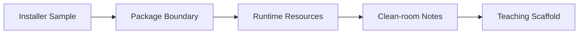

# s01: 安装包取证

[返回首页](../../../README.md)

> Harness 层：先找到边界。不要从“聊天界面”开始猜架构，要从包体和运行时证据开始。

## 代码架构图



## 问题

如果想从 0 复刻 WorkBuddy，第一步不是写代码，而是判断它到底由哪些可执行单元组成：Electron 桌面壳、CLI harness、本地服务、资源包、运行时目录分别在哪里。

## WorkBuddy 观察

下载包位于：

```text
[local Downloads installer sample]
```

挂载后核心结构是：

```text
WorkBuddy.app/Contents/Resources/
  桌面包体资源
  unpacked runtime resources/
    cli/
      bin/codebuddy
      dist/CLI bundle
      dist/web-ui/
    resources/
      builtin-skills/
      builtin-plugins/
      builtin-mcp-apps/
    node_modules/
  vendor/
    node.tar.gz
    python.dat
```

这说明它至少有三层：

1. Electron desktop。
2. CLI agent harness。
3. 被 desktop/CLI 共同使用的动态资源和扩展。

## 复刻方式

教学版先建立同样的边界：

```text
mini_workbuddy/
  server.py      # CLI harness as HTTP/ACP server
  sidecar.py     # sidecar process manager
  agent.py       # agent loop
  tools.py       # tools and permissions
  storage.py     # JSONL/tool-result persistence
```

## 试一下

```bash
python3 examples/mini_workbuddy_demo/code.py
```

观察生成的 `~/.mini_workbuddy/projects/.../*.jsonl`，它就是教学版的 transcript。
