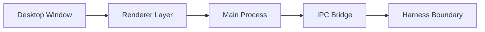

# s02: Electron 桌面壳

[返回首页](../../../README.md)

> Harness 层：UI 是客户端，不是 agent core。

## 代码架构图



## 问题

桌面 app 很容易被误解成“前端就是产品”。WorkBuddy 的前端只是入口；真正执行工具、跑会话、管理进程的是 main 进程和 CLI sidecar。

## WorkBuddy 观察

`桌面包体资源` 顶层结构：

```text
main/
preload/
renderer/
package.json
```

关键职责：

| 层 | 职责 |
|---|---|
| `renderer/` | React UI、聊天页、connector、automation、expert picker |
| `preload/` | 用 `contextBridge` 暴露有限 IPC 能力 |
| `main/` | 窗口、菜单、认证、产品配置、daemon、sidecar、SQLite、插件种子 |

## 复刻方式

教学版不强制写 Electron。你只要记住接口：

```text
Renderer sends prompt
Main resolves session
Sidecar ensures CLI server
Renderer subscribes session_update
```

在 [s10_frontend_runtime](../s10_frontend_runtime/) 会解释前端如何消费这些事件。

