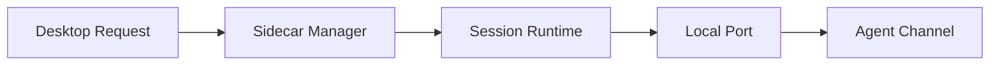

# s03: Sidecar Gateway

[返回首页](../../../README.md)

> Harness 层：用进程边界保护 agent runtime。

## 代码架构图



## 问题

Agent 会执行 shell、读写文件、连接 MCP、长时间运行。把这些放进 UI 进程会让生命周期、崩溃恢复、安全边界都变糟。

## WorkBuddy 观察

本地样本 包体中 `main/sidecar-entry.js` 暴露一个控制 socket。可观察到的方法包括：

```text
session.create
session.reconnect
session.resize
session.kill
session.list
session.capture
sidecar.ping
sidecar.shutdown
```

创建 session 时，sidecar 启动 `codebuddy --serve`，并得到：

```text
http://127.0.0.1:<port>/api/v1/acp
```

这就是桌面端和 agent core 的协议边界。

`main/protocol.js` 和 `main/sidecar-entry.js` 还显示了几个很关键的工程细节：

| 机制 | 观察 | 作用 |
|---|---|---|
| RingBuffer | `DEFAULT_RING_BUFFER_BYTES = 8 * 1024 * 1024` | 固定 8MB 输出回放窗口，支持窗口刷新和 `session.capture` |
| Idle timeout | `IDLE_TIMEOUT_MS = 1800 * 1000` | 30 分钟无会话/无控制连接后退出 sidecar |
| 控制面与数据面 | JSON-RPC 控制 socket + PTY/pipe 输出流 | 控制命令和终端字节流分离 |
| 环境变量隔离 | 屏蔽 `CODEBUDDY_`、`ELECTRON_`、`VITE_` 等前缀 | 避免 Desktop 内部配置污染 CLI session |
| 平台差异 | macOS/Linux 用 PTY，Windows 用 pipe | ACP/HTTP 是真实协议，TTY 只是承载输出的实现细节 |

这说明 sidecar 不是简单的 `spawn()` 包装器，而是一个小型 session supervisor。

## 复刻方式

教学版 `mini_workbuddy.sidecar` 提供一个极简控制 socket：

```bash
python3 -m mini_workbuddy.sidecar
```

它能接收 JSON-RPC：

```json
{"jsonrpc":"2.0","id":1,"method":"session.create","params":{"sessionId":"demo","port":8765}}
```

然后启动：

```bash
python3 -m mini_workbuddy.server --port 8765
```

下一步可以给教学版补一个固定大小 ring buffer：

```python
class RingBuffer:
    def __init__(self, cap=8 * 1024 * 1024): ...
    def write(self, data: bytes): ...
    def snapshot(self, lines: int | None = None) -> str: ...
```

这样 `session.reconnect` 和 `session.capture` 就不依赖完整日志文件。
