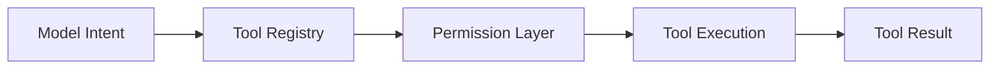

# s06: Agent Loop 与工具

[返回首页](../../../README.md)

> Harness 层：模型决定，harness 执行。

## 代码架构图



## 问题

Agent 产品的核心不是“写很多 if-else 让 AI 看起来聪明”，而是把工具暴露给模型，让模型在循环中决定下一步。

## WorkBuddy 观察

WorkBuddy CLI 有：

- shell / bash 工具。
- 文件系统工具。
- MCP 工具。
- deferred tool loading / ToolSearch。
- permission mode。
- 大输出外部化。

CLI bundle 中可观察到：

```text
ToolSearch
deferLoading
CODEBUDDY_TOOL_RESULT_THRESHOLD_KB
BASH_MAX_OUTPUT_LENGTH
```

## 复刻方式

教学版的工具注册：

```python
self._tools = {
    "bash": self._bash,
    "read_file": self._read_file,
    "tool_search": self._tool_search,
}
```

危险命令会被拒绝，例如：

```bash
rm
sudo
shutdown
reboot
mkfs
dd
```

这不是完整安全系统，但它让读者看见 permission layer 应该放在哪里。

