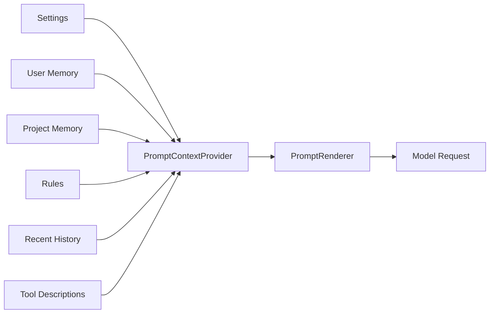

# s07: 上下文与记忆

[返回首页](../../../README.md)

> Harness 层：上下文窗口是内存，磁盘是外存。

## 代码架构图


## 本章目标

WorkBuddy 的记忆系统不是单一的“记住这个”功能，而是一套上下文内存管理系统。本章要复刻四件事：

1. 会话历史持久化：所有消息和工具调用写入 JSONL。
2. 工具输出外部化：大输出写磁盘，history 里只留预览和路径。
3. 静态记忆注入：用户记忆、项目记忆、规则文件进入 prompt context。
4. 压缩与恢复：上下文接近上限时，把早期历史压成 summary。

更完整的包体结构与记忆系统专项分析见 [docs/architecture/source-and-memory-system.md](../../../architecture/source-and-memory-system.md)。

## 根本问题

LLM 上下文有限，但 agent 工作会无限增长：文件内容、shell 输出、MCP 返回、历史对话、工具 schema 都会占空间。WorkBuddy 的策略不是单点优化，而是把上下文窗口当作操作系统内存来管理：

```text
上下文窗口 = RAM
JSONL transcript = WAL / event log
tool-results = swap file
CODEBUDDY.md / MEMORY.md = config / profile
compact summary = GC 后留下的活对象摘要
```

## WorkBuddy 观察

WorkBuddy 有多层策略：

| 机制 | 观察 |
|---|---|
| JSONL transcript | `~/.workbuddy/projects/.../<session>.jsonl` |
| 输出外部化 | `~/.workbuddy/projects/.../<session>/tool-results/*.txt` |
| session 回放限制 | `CODEBUDDY_SESSION_MAX_ITEMS`，默认可观察为 1000 |
| 自动压缩 | `CODEBUDDY_PRE_MESSAGE_COMPACT_PCT`、`CODEBUDDY_AUTOCOMPACT_PCT_OVERRIDE` |
| 压缩模块 | `ContextCompactSummarizer`、`CompactType.PRE_MESSAGE_AUTO`、`CompactType.EMERGENCY_AUTO` |
| 记忆初始化 | `MemoryPromptContextInitializer`、`PromptContextProviderImpl` |
| 记忆文件 | `CODEBUDDY.md`、`CODEBUDDY.local.md`、rules、Auto Memory |
| typed memory | `user`、`feedback`、`project`、`reference` |
| 前端显示 | `compact_group`，压缩历史作为可折叠节点 |

运行时 JSONL 中可观察到的消息类型：

| type | 作用 |
|---|---|
| `message` | 用户/助手消息 |
| `reasoning` | 推理内容 |
| `function_call` | 工具调用 |
| `function_call_result` | 工具结果 |
| `file-history-snapshot` | 文件历史快照 |
| `ai-title` | 自动标题 |

## 记忆分层

WorkBuddy 的记忆可以分成五层：

| 层 | 内容 | 注入方式 | 复刻优先级 |
|---|---|---|---|
| 静态用户记忆 | 用户偏好、长期习惯 | 启动时加载 | 高 |
| 项目记忆 | 架构、命令、团队规范 | 按 cwd 向上递归加载 | 高 |
| 规则记忆 | `.codebuddy/rules/*.md` | 按 frontmatter 和路径条件加载 | 中 |
| Auto Memory | 模型自主维护的 typed memory | 索引文件前 N 行 + 按需主题文件 | 中 |
| 会话历史 | JSONL transcript 和 compact summary | session/load 回放 | 最高 |

复刻时不要先做复杂的“AI 自动记忆”。先做稳定的数据路径：能写、能读、能恢复、能控制预算。

## Prompt Context Pipeline

最小可复刻结构：



每个上下文块都应该带预算：

```python
ContextBlock(
    name="project_memory",
    priority=80,
    max_chars=6000,
    content="..."
)
```

预算不够时，优先丢低优先级块，而不是随机截断整段 prompt。

## Tool-result Swap

工具输出外部化是最值得先实现的机制。

```text
result <= threshold:
  history.append(full_result)

result > threshold:
  path = tool-results/<call_id>.txt
  write(path, full_result)
  history.append({
    "externalized": true,
    "path": path,
    "preview": head + tail
  })
```

这让模型知道“结果很大，完整内容在某个文件里”，后续可以按需读取。它比把全部输出塞进上下文可靠得多。

## Compact

压缩可以先做成确定性流程：

```text
if estimated_tokens(history) > max_tokens * threshold:
  older = history[:-recent_window]
  recent = history[-recent_window:]
  summary = summarize(older)
  history = [compact_group(summary)] + recent
```

WorkBuddy 可观察到两类触发：

| 触发 | 说明 |
|---|---|
| pre-message compact | 用户新消息进入前先确保空间 |
| emergency auto compact | 模型请求前发现 token 高水位，异步或阻塞压缩 |

关键细节：

- 压缩要有冷却时间，避免循环压缩。
- 压缩前检查是否有“有意义的新历史”，避免反复压同一段。
- 最近几轮原文要保留，避免模型失去短期任务状态。
- 压缩结果要作为显式事件进入 history，而不是偷偷修改历史。

## 复刻方式

当前教学版已经实现：

1. 每条消息和工具结果写 JSONL。
2. 工具输出超过阈值时写 `tool-results/*.txt`，消息里只留预览和路径。

运行后查看：

```bash
find ~/.mini_workbuddy -maxdepth 5 -type f
```

下一步建议在教学版中继续补三个模块：

| 模块 | 文件 | 职责 |
|---|---|---|
| MemoryLoader | `mini_workbuddy/memory.py` | 读取用户/项目 memory 和 rules |
| ContextProvider | `mini_workbuddy/context.py` | 按预算组装上下文块 |
| Compactor | `mini_workbuddy/compaction.py` | 把旧 history 摘要成 compact group |

## 练习

1. 降低 `tool_result_threshold_chars`，运行一个大输出命令，观察 `tool-results`。
2. 新建项目记忆文件，让下一轮 agent 输出能引用它。
3. 人为把 `max_context_chars` 设小，触发一次 compact。
4. 实现 `GET /api/v1/memory`，返回当前会话加载的 memory block 列表。
