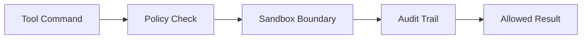

# s09: 沙盒与安全

[返回首页](../../../README.md)

> Harness 层：本地 agent 的默认风险是 RCE。

## 代码架构图



## 问题

只要 agent 能跑 shell，它就是一个本地代码执行系统。安全不能靠“模型会乖”。

## WorkBuddy 观察

本地样本显示出这些安全层：

- `sandbox-config.json`
- `cli/vendor/sandbox/sandbox-cli`
- `vendor/sandbox/tsbx_rules.json`
- `--permission-mode`
- `mcp-approvals.json`
- 本地 gateway 自定义请求头与随机请求凭证
- sidecar gateway 请求凭证相关修复线索（仅保留架构含义）
- 对敏感目录如 `.ssh`、`.gnupg` 的保护规则

REST API 文档还要求非豁免路径带自定义请求头：

```text
X-CodeBuddy-Request: 1
```

`cli/sandbox-config.json` 可观察到 macOS 沙盒组件：

| 字段 | 值 |
|---|---|
| `bundleId` | `com.workbuddy.workbuddy` |
| `appGroupId` | `group.com.workbuddy.workbuddy` |
| `fileProviderBundleId` | `com.workbuddy.workbuddy.FileProvider` |
| `networkExtensionBundleId` | `com.workbuddy.workbuddy.NetworkExtension` |
| `helperBundleId` | `com.workbuddy.workbuddy.SandboxHelper` |

运行时还有审计日志：

```text
~/.workbuddy/audit-log/YYYY-MM-DD.jsonl
~/.workbuddy/audit-log/spool/audit-spool-<pid>-YYYY-MM-DD.jsonl
```

按日审计文件中可观察到 `sequence`、`prevHash`、`hash` 字段，事件类型包括 `command-safety.sandbox-executed`。这是一条哈希链：每条记录引用上一条记录的 hash，用来提高审计日志被篡改后的可发现性。

## 复刻方式

教学版模拟三点：

1. REST 管理接口必须带 `X-Mini-WorkBuddy-Request: 1`。
2. `bash` 工具拒绝明显危险命令。
3. 工具执行被限制在 session `cwd` 语义内。

生产版还应加入 OS sandbox、网络策略、审批工作流和审计日志。

最小可复刻审计链：

```text
event.sequence = previous.sequence + 1
event.prevHash = previous.hash
event.hash = sha256(canonical_json(event_without_hash) + prevHash)
append event as JSONL
```

这不会替代真正沙盒，但能让所有危险动作有可追溯轨迹。
