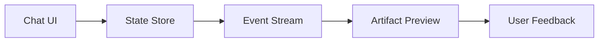

# s10: 前端运行时

[返回首页](../../../README.md)

> Harness 层：前端消费事件，不直接执行世界动作。

## 代码架构图



## 问题

Agent UI 的难点不是展示一段文本，而是把流式事件、工具调用、权限请求、终端输出、文件变更和多 agent 状态稳定地组织成用户能理解的界面。

## WorkBuddy 观察

renderer 资源名显示了主要前端模块：

```text
agent-chat-pane-*
colleague-chat-page-*
connector-*
automation-panel-*
expert-picker-*
FileTabs-*
codeEditor-*
```

preload 用 `contextBridge` 暴露有限能力，而不是让 renderer 直接拿 Node 权限。

## 复刻方式

教学版前端可以只做一件事：

```text
subscribe /api/v1/acp/events
render session_update
POST session/prompt
```

事件形状：

```json
{"sessionId":"...","type":"tool_call","tool":"bash","argument":"ls -la"}
{"sessionId":"...","type":"tool_result","name":"bash","content":"..."}
{"sessionId":"...","role":"assistant","content":"..."}
```

