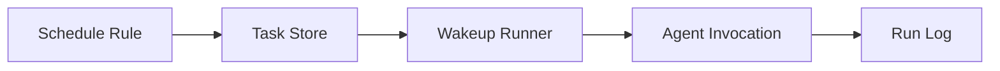

# s11: 后台任务与自动化

[返回首页](../../../README.md)

> Harness 层：会话不一定绑定一个前台聊天窗口。

## 代码架构图



## 问题

真实 agent 产品需要后台任务、定时任务、远程控制和长期 daemon。否则所有事情都必须用户盯着聊天框跑。

## WorkBuddy 观察

CLI 支持：

```text
codebuddy daemon start/status/stop/restart
codebuddy --bg
codebuddy ps
codebuddy logs
codebuddy attach
codebuddy kill
```

桌面 SQLite 中有：

```text
automations
automation_runs
automation_runtime_state
```

这说明自动化是桌面产品级能力，不只是 CLI 参数。

## 复刻方式

教学版目前只保留接口位置：

```text
POST /api/v1/runs
Sidecar session.create
```

下一步可以加：

- `automations.json`
- 简单 interval scheduler
- run state
- logs endpoint

