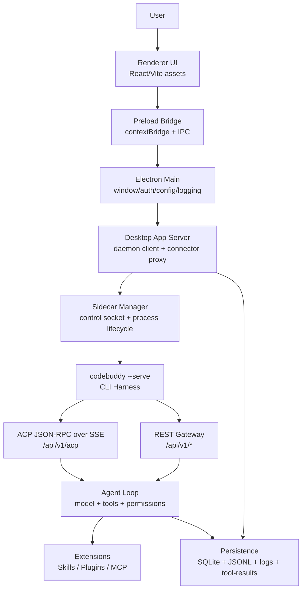
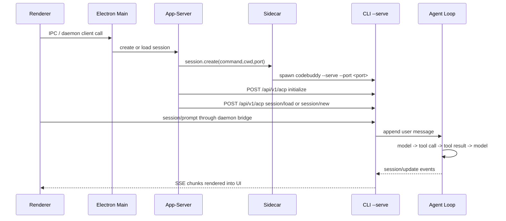

# WorkBuddy Harness 架构图谱

## 分层视图



## 为什么要有 sidecar

直接把 agent loop 放进 Electron renderer 有三个问题：

1. Renderer 是 UI 进程，不适合持有 shell、PTY、文件系统和长任务。
2. Agent session 需要可重启、可恢复、可隔离，进程边界比组件边界可靠。
3. CLI 本身也要独立作为终端工具、daemon、HTTP server、ACP server 使用。

所以 WorkBuddy 的边界是：

```text
Desktop = 产品外壳 + 本地 orchestrator
CLI sidecar = agent runtime
ACP/REST = 两者之间的稳定协议
```

## 请求生命周期

一次用户发送消息，大致会经过：



## Harness 子系统

| 子系统 | WorkBuddy 中的观察 | 复刻时的最小实现 |
|---|---|---|
| Agent Loop | CLI bundle 内的 session/prompt、tool calling、stream-json | `while model wants tool: run tool and append result` |
| Tool Registry | 内置工具、MCP 工具、defer loading、ToolSearch | `ToolRegistry` + `tool_search` |
| Permission | `--permission-mode`、approval、sandbox rules | 命令危险模式检测 + allow/deny |
| Output Externalization | `tool-results/*.txt`，大输出只留摘要和路径 | 输出超过阈值写磁盘，消息中留指针 |
| Memory | CODEBUDDY.md、rules、local memory、cloud memory | 用户记忆 + 项目记忆 + JSONL transcript |
| Protocol | ACP JSON-RPC/SSE + REST `/api/v1/*` | 标准库 HTTP server + JSON-RPC handler |
| Sidecar | 控制 socket + per-session process | Unix socket + subprocess/session table |
| Extensions | builtin-skills、plugins、MCP apps、connectors | 文件夹扫描 + 延迟描述 |
| Frontend | React renderer 消费 session/update | 教学版用 curl/SSE，前端章节解释事件形状 |

## 复刻路线

本教程的代码按“从内到外”构造：

1. 先写 agent loop 和工具系统。
2. 再加上下文预算、输出外部化和 JSONL 持久化。
3. 再包成 HTTP/ACP 服务。
4. 再加 sidecar 管理进程。
5. 最后解释桌面前端如何消费协议。

这样做的好处是：读者先理解 agent harness 的心脏，再理解产品壳。

