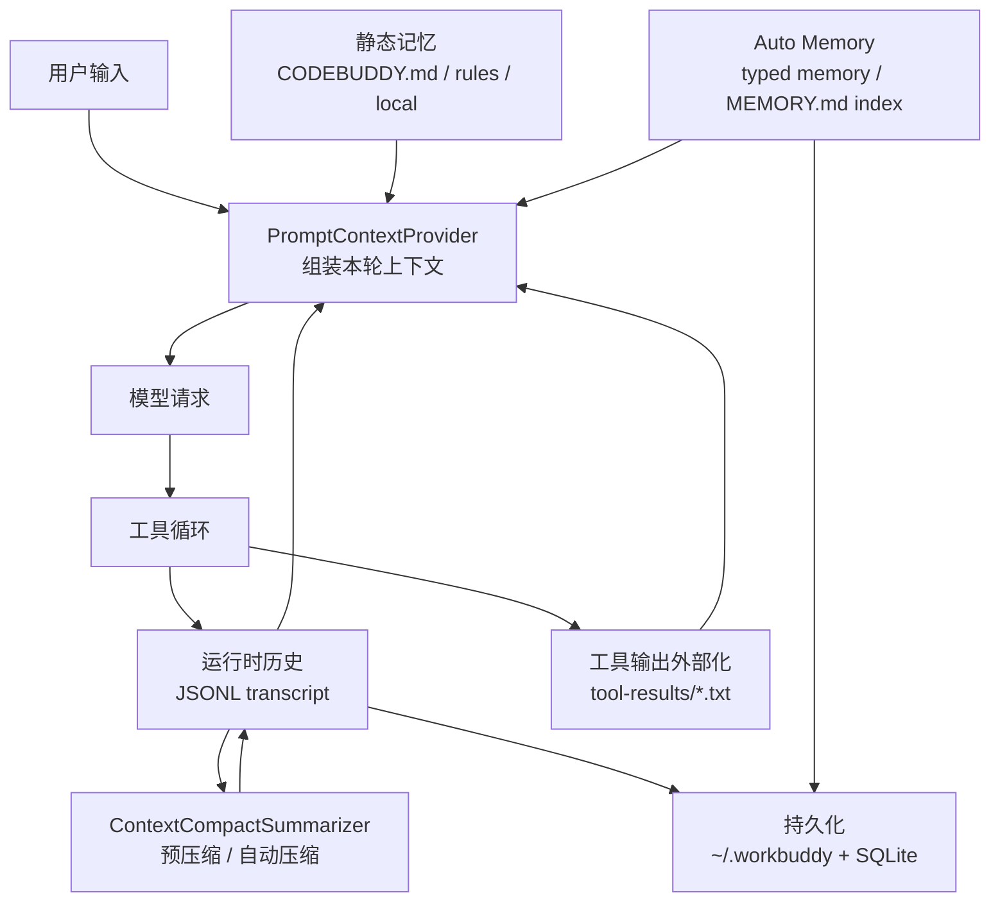
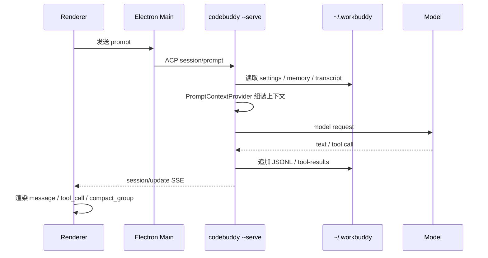

# WorkBuddy 包体结构与记忆系统专项分析

分析日期：2026-07-08  
对象版本：`local WorkBuddy installer sample`  
边界说明：本文只记录从安装包结构、公开 CLI 文档、运行时文件、bundle 符号名和协议形状中可观察到的架构，不复制 WorkBuddy 闭源实现。

## 结论速览

WorkBuddy 的“记忆系统”不是一个孤立模块，而是分布在 agent harness 的多个阶段：



它的核心目标是把有限上下文窗口当作“内存”来管理：少进、晚进、可换出、可压缩、可恢复。

## 包体资源结构

本地样本中的关键资源类别：

| 路径 | 作用 |
|---|---|
| `WorkBuddy.app/Contents/Resources/桌面包体资源` | Electron main、renderer、部分 CLI 索引和依赖 |
| `桌面包体资源/main/module.app-server.js` | Desktop app-server、daemon、sidecar gateway、REST/ACP 协调 |
| `桌面包体资源/main/sidecar-entry.js` | sidecar 控制 socket、session process 生命周期 |
| `桌面包体资源/agent bridge module` | ACP schema、JSON-RPC 方法映射 |
| `桌面包体资源/renderer/assets/*` | React/Vite 前端资源 |
| `CLI runtime resources/bin/codebuddy` | CLI 启动入口 |
| `CLI runtime resources/dist/CLI bundle` | CLI harness 主 bundle，约 21MB |
| `CLI runtime resources/dist/web-ui/docs/cn/cli/*.md` | 随包 CLI 文档 |
| `unpacked runtime resources/resources/templates/*.tpl` | 系统提示模板、模式提示、上下文注入模板 |
| `unpacked runtime resources/resources/builtin-skills/` | 内置 skills |
| `unpacked runtime resources/resources/builtin-plugins/` | 内置 plugins |
| `unpacked runtime resources/resources/builtin-mcp-apps/` | 内置 MCP apps |

## Harness 资源分层

WorkBuddy 的资源包可以按职责分成四层：

| 层 | 位置 | 职责 |
|---|---|---|
| Desktop Shell | `main/`, `preload/`, `renderer/` | 窗口、登录、插件种子、UI、IPC、sidecar 编排 |
| Sidecar Gateway | `main/sidecar-entry.js`, `module.app-server.js` | 为每个会话启动或连接 CLI `--serve` 进程 |
| CLI Harness | `cli/dist/CLI bundle` | agent loop、工具、权限、上下文、压缩、记忆、HTTP/ACP |
| Runtime Store | `~/.workbuddy/` | SQLite、JSONL、任务、artifact、memory、logs、connectors |

从 bundle 符号和公开文档可观察到的 CLI harness 关键模块名包括：

| 符号/模块名 | 可推断职责 |
|---|---|
| `RunnerFactoryImpl` | 创建 agent runner，在模型请求前挂载过滤、压缩、loop detector |
| `ContextCompactSummarizer` | 上下文压缩入口，处理预压缩和紧急压缩 |
| `PromptContextProviderImpl` | 汇总系统提示、设置、记忆、工具说明、会话状态 |
| `PromptRendererImpl` | 将模板变量渲染成最终模型上下文 |
| `MemoryPromptContextInitializer` | 记忆相关上下文初始化器 |
| `SettingsPromptContextInitializer` | 设置与模式相关上下文初始化器 |
| `SessionPromptContextInitializer` | 会话状态相关上下文初始化器 |
| `GitPromptContextInitializer` | Git 工作区相关上下文初始化器 |
| `CliDocsPromptContextInitializer` | CLI 文档/能力提示相关初始化器 |
| `DeferredToolsDescriptionBuilderImpl` | 工具延迟加载说明构造器 |
| `ContextTruncationServiceImpl` | 上下文截断服务 |
| `SmartTruncationStrategyService` | 智能截断策略 |
| `MaxTokenCompactStrategy` | 基于 token 上限的压缩策略 |
| `BlockingCompactStrategy` | 阻塞式压缩策略 |
| `ToolCallLoopDetector` | 防止模型重复调用同一工具 |
| `AcpAgent` | ACP 协议适配 |
| `SessionManager` | 当前会话、历史、状态管理 |

这些符号说明 WorkBuddy 的 CLI harness 使用依赖注入式架构：多个 initializer 在模型请求前把上下文块注入，再由 runner 统一执行模型调用和工具循环。

## 记忆系统的五层

### 1. 静态记忆：CODEBUDDY.md 与 rules

随包 CLI 文档 `cli/dist/web-ui/docs/cn/cli/memory.md` 描述了静态记忆的加载模型：

| 类型 | 典型位置 | 作用 |
|---|---|---|
| 用户记忆 | `~/.codebuddy/CODEBUDDY.md` | 跨项目个人偏好 |
| 用户规则 | `~/.codebuddy/rules/*.md` | 模块化个人规则 |
| 项目记忆 | `./CODEBUDDY.md` 或 `./.codebuddy/CODEBUDDY.md` | 团队共享项目指令 |
| 项目规则 | `./.codebuddy/rules/*.md` | 模块化项目规则 |
| 本地项目记忆 | `./CODEBUDDY.local.md` | 不提交到仓库的个人项目偏好 |

规则文件支持 frontmatter，例如 `enabled`、`alwaysApply`、`paths`。`paths` 可以让规则只在读写匹配文件时注入，从而减少常驻上下文开销。

复刻时可以把这一层做成：

```text
MemoryLoader
  load_user_memory()
  load_project_memory(cwd)
  load_rules(cwd, touched_paths)
  resolve_imports(max_depth=5)
```

### 2. Auto Memory：模型自主维护的长期记忆

CLI 文档还描述了 Auto Memory：

| 组件 | 设计含义 |
|---|---|
| `MEMORY.md` 索引 | 每个项目或全局记忆的入口，前若干行自动进入上下文 |
| 主题文件 | 详细记忆拆成独立文件，通过索引链接 |
| `autoMemoryEnabled` | 设置或环境变量控制是否启用 |
| Typed Memory | 使用 YAML frontmatter 区分 `user`、`feedback`、`project`、`reference` |

bundle 中可观察到 `CODEBUDDY_DISABLE_AUTO_MEMORY`、`CODEBUDDY_TYPED_MEMORY_ENABLED`、`autoMemoryEnabled`、`typedMemory` 等符号，说明 Auto Memory 是可配置子系统。

复刻时不要一开始就做“自动写记忆”的复杂 AI 判断。最小版本可以先做：

```text
~/.mini_workbuddy/memories/global/MEMORY.md
~/.mini_workbuddy/memories/<project-id>/MEMORY.md
~/.mini_workbuddy/memories/<project-id>/decisions.md
~/.mini_workbuddy/memories/<project-id>/preferences.md
```

然后只加载 `MEMORY.md` 的前 N 行，详细文件按需读取。

### 3. 模板注入：Prompt Context

WorkBuddy 包内的 `resources/templates/*.tpl` 显示：模型请求前会把多个上下文块渲染进提示模板，例如产品身份、工作模式、用户自定义指令、工作记忆、用户本地记忆、用户记忆等。

不要把模板理解成“系统提示文件”。它实际是一个上下文编排层：

```text
PromptContextInitializer[] -> PromptContextProvider -> PromptRenderer -> model input
```

这层的设计重点是“分块”。每一种上下文都应该有来源、优先级、预算和可开关配置。

### 4. 会话历史：JSONL transcript

运行时 `~/.workbuddy/projects/<workspace>/<session>.jsonl` 是会话恢复和回放的主要证据。观察到的事件类型包括：

| JSONL type | 作用 |
|---|---|
| `message` | 用户/助手消息 |
| `reasoning` | 推理内容 |
| `function_call` | 工具调用 |
| `function_call_result` | 工具结果 |
| `file-history-snapshot` | 文件历史快照 |
| `ai-title` | 自动生成会话标题 |

JSONL 的好处是追加写入简单、崩溃恢复容易、可以倒序扫描、可以按 session 做迁移。

复刻时建议消息模型保持 append-only：

```json
{"type":"message","role":"user","content":"...","timestamp":...}
{"type":"function_call","name":"bash","arguments":{...},"callId":"..."}
{"type":"function_call_result","callId":"...","output":{...}}
```

### 5. 工具输出外部化：tool-result swap

运行时可观察到 `~/.workbuddy/projects/.../<session>/tool-results/*.txt`。bundle 中也能看到 `CODEBUDDY_TOOL_RESULT_THRESHOLD_KB`、`BASH_MAX_OUTPUT_LENGTH`、`tool-results` 等符号。

它解决的是工具结果过大导致上下文爆炸的问题：

```text
工具结果很小 -> 直接进入 history
工具结果很大 -> 全量写入磁盘，history 中只保留摘要、预览、路径
```

这就是 LLM harness 的 swap 机制。复刻时这层比“智能记忆”更优先，因为它直接决定长任务能不能跑下去。

## 压缩系统

bundle 中可观察到两类压缩触发：

| 类型 | 符号/环境变量 | 触发点 |
|---|---|---|
| 预消息压缩 | `CODEBUDDY_PRE_MESSAGE_COMPACT_PCT` | 用户新消息进入前 |
| 紧急自动压缩 | `CODEBUDDY_AUTOCOMPACT_PCT_OVERRIDE` | 模型请求前 token 使用量超过阈值 |

相关可观察符号：

| 符号 | 含义 |
|---|---|
| `ContextCompactSummarizer` | 压缩执行器 |
| `CompactType.PRE_MESSAGE_AUTO` | 用户消息前预压缩 |
| `CompactType.EMERGENCY_AUTO` | 高水位紧急压缩 |
| `resolveCompactTriggerAt` | 根据模型 max input tokens 计算触发点 |
| `estimateTrailingToolResultTokens` | 把尾部工具结果估算进 token 使用量 |
| `hasMeaningfulNewHistorySinceLastCompact` | 防止没有新增信息时反复压缩 |
| `lastCompactTimestamp` | 压缩冷却时间，观察到 30 秒级别 |
| `compact_group` | 前端渲染压缩分组的消息类型 |

压缩不是删除历史，而是把历史转成更短的 summary item。前端资源中有 `compact_group` 和 “Conversation compacted” 的渲染线索，说明压缩结果在 UI 上是一个可折叠的历史节点。

复刻时最小策略：

```text
if estimated_tokens(history) > max_tokens * threshold:
    keep recent N items unchanged
    summarize older items into one "summary" message
    append compact marker
```

这里的 summary 可以先用规则摘要，后续再接小模型。

## 运行时持久化

本机 `~/.workbuddy` 中与记忆/上下文相关的文件：

| 路径 | 观察 |
|---|---|
| `settings.json` | 插件开关、sandbox 白名单、用户 owner id |
| `app/sessions.json` | conversationId、userId、workDir、startedAt、resumedAt |
| `memory/<uid>_memory.md` | 用户记忆画像或本地记忆材料 |
| `app/memory/polling-lease-*.json` | Auto Memory 轮询/后台任务 lease |
| `projects/<workspace>/<session>.jsonl` | 会话 transcript |
| `projects/<workspace>/<session>/tool-results/*.txt` | 大工具输出 |
| `artifact-index/<session>.json` | 产物索引 |
| `tasks/<session>/*.json` | 任务状态 |
| `workbuddy.db` | 桌面级索引数据库 |

SQLite 表结构显示 `workbuddy.db` 更偏桌面索引和调度，不是完整消息数据库：

| 表 | 作用 |
|---|---|
| `sessions` | 会话元信息 |
| `session_usage` | token/额度使用统计 |
| `automations` | 自动化定义 |
| `automation_runs` | 自动化运行历史 |
| `automation_runtime_state` | 自动化运行态 |
| `workspaces` | 工作区打开记录 |

结论：WorkBuddy 的会话正文主要走 JSONL，数据库主要放可查询索引、状态和调度。

## 前后端如何消费记忆

记忆系统对前端不是“文件浏览器”，而是 session/update 事件流的一部分：



前端只需要理解事件形状：消息、工具调用、工具结果、压缩分组、会话信息更新。记忆文件本身不应该直接耦合到 UI。

## 从 0 复刻的建议顺序

不要一上来做“智能记忆”。建议按下面顺序：

1. **Transcript**：先做 append-only JSONL，所有消息和工具调用都能恢复。
2. **Tool-result swap**：大输出写磁盘，history 只保留路径和预览。
3. **Static memory**：加载用户和项目 `MEMORY.md` / `CODEBUDDY.md`。
4. **Rules**：支持 frontmatter、路径匹配和条件注入。
5. **Prompt context pipeline**：把 settings、memory、tools、session 分成 initializer。
6. **Compaction**：达到阈值时摘要早期历史，保留最近窗口。
7. **Auto Memory**：从会话中提取稳定偏好/项目事实，写入 typed memory 文件。
8. **Search/selector**：做轻量检索或小模型筛选，只注入相关记忆。

对应的教学版模块可以这样拆：

```text
mini_workbuddy/
  memory.py          # MemoryStore / MemoryLoader / RuleMatcher
  context.py         # PromptContextProvider / budget allocator
  compaction.py      # CompactStrategy / summarizer
  storage.py         # JSONL + tool-results + session metadata
  agent.py           # agent loop 调用 context provider
```

## 最小可复刻接口

记忆系统不需要一开始暴露很多 UI。最小 HTTP/ACP 接口：

| 接口 | 作用 |
|---|---|
| `GET /api/v1/memory` | 查看当前会话加载了哪些记忆块 |
| `POST /api/v1/memory/reload` | 清缓存并重载记忆 |
| `POST /api/v1/memory/write` | 写入一条 typed memory |
| `GET /api/v1/sessions/:id/history` | 读取 JSONL 历史 |
| `POST /api/v1/sessions/:id/compact` | 手动触发压缩 |

在 ACP 中，对应事件可以是：

```text
session/update: memory_loaded
session/update: compact_started
session/update: compact_finished
session/update: tool_result_externalized
```

## 关键设计取舍

| 问题 | WorkBuddy 的可观察选择 | 复刻建议 |
|---|---|---|
| 长历史怎么存 | JSONL transcript | 保持 append-only，易恢复 |
| 大工具输出怎么处理 | 写 `tool-results/*.txt` | 先实现，收益最高 |
| 静态记忆怎么组织 | CODEBUDDY.md + rules | 兼容 AGENTS.md 可选 |
| 自动记忆怎么组织 | MEMORY.md 索引 + typed files | 先手动写，再自动提取 |
| 什么时候压缩 | 预消息 + 高水位 | 至少实现高水位 |
| 压缩后 UI 怎么显示 | `compact_group` | 前端显示可折叠 summary |
| 工具 schema 怎么省上下文 | ToolSearch / deferred tools | 工具多时再做 |
| 子代理怎么省上下文 | 独立上下文窗口 | 长探索任务单独 session |

## 对教程的落地要求

要把 WorkBuddy 复刻成开源教程，记忆系统章节至少应该让读者完成四个实验：

1. 跑一个会话，观察 JSONL 如何增长。
2. 运行一个大输出工具，观察 `tool-results` 如何外部化。
3. 添加项目记忆文件，观察下一轮 prompt context 增加了什么。
4. 人为降低 token 阈值，观察 compact summary 如何替换早期历史。

这四个实验做完，读者就理解了 WorkBuddy 记忆系统的工程本质，而不是只记住几个文件名。
