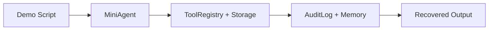

# Mini WorkBuddy 集成 demo

[返回首页](../../README.md)

> Harness 层：把前面的机制连起来，得到一个最小 WorkBuddy。

## 代码架构图



## 包含什么

`mini_workbuddy` 实现了：

| 文件 | 作用 |
|---|---|
| `config.py` | 运行时目录、阈值、请求头 |
| `storage.py` | session record、JSONL transcript、tool-results |
| `tools.py` | bash/read_file/tool_search、权限和输出外部化 |
| `agent.py` | 简化 agent loop |
| `audit.py` | append-only hash chain 审计日志 |
| `server.py` | REST + ACP endpoint + SSE events |
| `sidecar.py` | Unix socket sidecar manager |

## 运行单次 demo

默认 `auto` 模式：如果 `.env` 里有 `ANTHROPIC_API_KEY` 和 `MODEL_ID`，会调用真实模型；否则回退到离线 deterministic harness。

```bash
python3 examples/mini_workbuddy_demo/code.py
```

真实 API 模式：

```bash
cp .env.example .env
# 编辑 .env，填入 ANTHROPIC_API_KEY 和 MODEL_ID
python3 examples/mini_workbuddy_demo/code.py --mode real
```

离线 CI 模式：

```bash
python3 examples/mini_workbuddy_demo/code.py --mode offline
```

真实 API 模式会让模型自己发起 `tool_use`，mini harness 负责执行工具、写 transcript、写 audit、处理 tool result。离线模式会自动跑过：

- `tools`: 工具目录与延迟发现入口。
- `pwd`: shell 工具执行。
- `read README.md`: 文件读取。
- `bash rm -rf .`: 权限拒绝。
- `bash python3 -c "print('x' * 70000)"`: 大输出外部化到 `tool-results/`。
- workspace memory 写入和读取。
- JSONL transcript 恢复。
- audit hash chain 校验。

## 启动服务

```bash
python3 -m mini_workbuddy.server --port 8765
```

健康检查：

```bash
curl --noproxy '*' http://127.0.0.1:8765/api/v1/health
```

发起 run：

```bash
curl --noproxy '*' -s -X POST http://127.0.0.1:8765/api/v1/runs \
  -H 'Content-Type: application/json' \
  -H 'X-Mini-WorkBuddy-Request: 1' \
  -d '{"prompt":"list files","cwd":"."}'
```

ACP 初始化：

```bash
curl --noproxy '*' -s -X POST http://127.0.0.1:8765/api/v1/acp \
  -H 'Content-Type: application/json' \
  -H 'X-Mini-WorkBuddy-Request: 1' \
  -d '{"jsonrpc":"2.0","id":1,"method":"initialize","params":{}}'
```

如果本机配置了代理，保留 `--noproxy '*'`。否则 curl 可能把 `127.0.0.1` 请求发给代理，得到空响应或 502。

## 关键学习点

这个 mini 版本不模拟模型智力，只模拟 harness 结构。真实产品里，`MiniAgent._plan()` 的位置会换成 LLM 调用；工具、权限、事件、持久化和协议层的位置保持不变。
