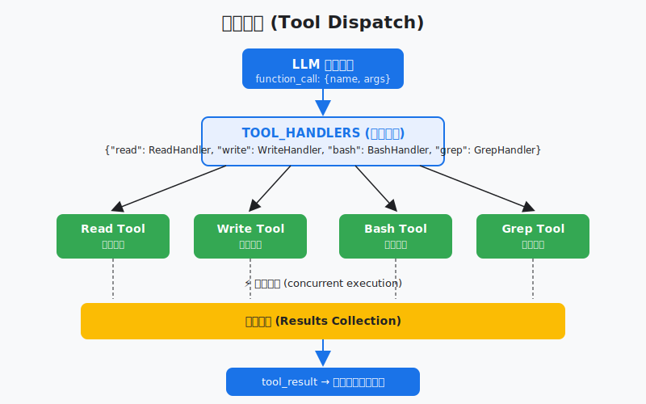
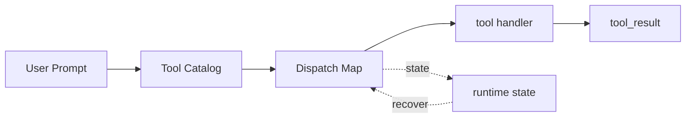

# s02: Tool Dispatch — 加工具不改循环

> *"加工具不改循环, 注册进 dispatch map"* — TOOL_HANDLERS, 并发执行。
>
> **Harness 层**: 工具 — agent 的双手。

---



## 代码架构图



## 学习前置知识

- 工具定义分两层: 给模型看的 schema, 以及本地真正执行的 handler。
- 工具名是协议边界, handler 是实现细节。
- 并发执行只适合没有顺序依赖的工具。

## 本章抓住的 WorkBuddy-style 机制

- 把工具注册到 dispatch map, 新增能力不改 agent loop。
- 用 safe_path 给文件工具加工作区边界。
- 用并发执行模拟多个只读工具同时运行。

## 常见误区

- 让模型直接写 shell 字符串完成所有事, 安全和可观测性都会变差。
- 工具 schema 写得太随意, 模型会构造出难以执行的参数。
- 所有工具都并发可能破坏写后读、创建后编辑这类依赖。
## 问题

s01 里模型只有 bash 一个工具。读文件要 `cat`，写文件要 `echo ... >`，找文件要 `find`。又丑又容易出错。

WorkBuddy-style 桌面 agent 往往有多组 RPC 领域、内置工具池（Read/Write/Edit/Bash/Glob/Grep/TaskCreate 等）、加上 MCP 连接器动态发现的工具。这么多工具怎么管理？

---

## 解决方案

一个字典：`TOOL_HANDLERS = {"bash": run_bash, "read": run_read, ...}`。循环不用动，新工具注册进字典就行。

模型返回的每个 `tool_use` block 里有 `block.name`，用这个名字去字典里找 handler，执行它，把结果喂回去。

---

## 工作原理

### 工具定义 + Handler 注册

每个工具有两部分：定义（给模型看的 schema）和 handler（执行函数）。

```python
TOOLS = [
    {"name": "bash", "description": "Run a shell command.",
     "input_schema": {"type": "object",
         "properties": {"command": {"type": "string"}},
         "required": ["command"]}},
    {"name": "read_file", "description": "Read file contents.",
     "input_schema": {"type": "object",
         "properties": {"path": {"type": "string"}},
         "required": ["path"]}},
    # ... more tools
]

TOOL_HANDLERS = {
    "bash": run_bash,
    "read_file": run_read,
    # ... more handlers
}
```

### 分发逻辑

循环里只改一行——用 dispatch map 替代硬编码：

```python
for block in response.content:
    if block.type == "tool_use":
        handler = TOOL_HANDLERS.get(block.name)
        output = handler(**block.input) if handler else f"Unknown: {block.name}"
        results.append({"type": "tool_result", "tool_use_id": block.id, "content": output})
```

### 路径安全

文件操作工具需要路径安全检查，防止 agent 读写工作区外的文件：

```python
def safe_path(p: str) -> Path:
    path = (WORKDIR / p).resolve()
    if not path.is_relative_to(WORKDIR):
        raise ValueError(f"Path escapes workspace: {p}")
    return path
```

WorkBuddy 在沙盒层面做这个检查（s23 会讲）。教学版用 Python 的 `is_relative_to` 做软限制。

### 并发执行

模型可以在一条响应里调用多个工具。s01 逐个执行，s02 用线程池并发：

```python
from concurrent.futures import ThreadPoolExecutor

with ThreadPoolExecutor(max_workers=4) as pool:
    futures = {}
    for block in response.content:
        if block.type == "tool_use":
            handler = TOOL_HANDLERS.get(block.name)
            futures[block.id] = pool.submit(handler, **block.input)
    
    for block in response.content:
        if block.type == "tool_use":
            output = futures[block.id].result()
            results.append({"type": "tool_result", "tool_use_id": block.id, "content": output})
```

WorkBuddy 的工具执行支持并发——不依赖前序结果的工具可以同时跑。但有些工具（如写文件后读文件）有顺序依赖，需要串行。教学版默认并发，简单场景够用。

---

## 相对 s01 的变更

| 组件 | 之前 (s01) | 之后 (s02) |
|------|-----------|-----------|
| 工具数量 | 1 (bash) | 5 (bash, read, write, edit, glob) |
| 分发方式 | 硬编码 `run_bash` | `TOOL_HANDLERS` dispatch map |
| 执行方式 | 串行 | 并发 (ThreadPoolExecutor) |
| 路径安全 | 无 | `safe_path()` 工作区限制 |
| 循环改动 | — | 只改分发行 |

---

## 试一下

```sh
python s02_tool_dispatch/code.py
```

试试这些 prompt：

1. `Read the README.md file and tell me what it says`
2. `Create a file called test.py with a hello world function, then read it back`
3. `Find all Python files in this directory`（观察 glob 工具）

观察重点：模型是否一次调用多个工具？多个工具是否并发执行？

---

## 接下来

工具多了，危险也多了。`rm -rf /` 怎么拦？写工作区外的文件怎么防？谁来决定一个操作能不能做？

s04 Permission & Hooks → 三道门 + 扩展点。

<details>
<summary>Clean-room 架构对照</summary>

### 多组 RPC 领域

生产级桌面 agent 的主进程通常会按领域注册多组 RPC 方法，每个领域包含多个动作：

| 领域 | 方法示例 | 用途 |
|------|---------|------|
| `session/` | create, destroy, list, send | 会话生命周期 |
| `tool/` | execute, list, interrupt | 工具执行 |
| `mcp/` | connect, disconnect, list | MCP 连接器管理 |
| `memory/` | getProfile, saveSettings, search | 记忆系统 |
| `skill/` | load, list, install | 技能系统 |
| `automation/` | create, update, delete, list | 自动化调度 |
| `sandbox/` | execute, check | 命令沙盒 |
| `audit/` | log, verify | 审计日志 |

每个领域是一组 JSON-RPC 方法，通过 Unix Socket 从主进程路由到 Sidecar 再到 CLI 会话。

### 工具注册

WorkBuddy 的工具不是静态字典，而是运行时动态组装：

```
assemble_tool_pool() = BUILTIN_TOOLS + MCP_TOOLS + SKILL_TOOLS
```

内置工具是固定的（Read/Write/Edit/Bash/Glob/Grep 等），MCP 工具是连接器动态发现的（`mcp__server__tool` 命名），技能工具是按需加载的。组装后统一注册到 dispatch map。

### 流式工具执行

WorkBuddy 的工具执行是流式的——模型还在生成响应时，已经确定要调用的工具就可以开始执行。这需要判断工具是否 "concurrency-safe"：只读工具可以并发，写工具需要独占。

教学版用 ThreadPoolExecutor 简化了这个过程。

</details>

---

## 下一课

工具分发了，dispatch map 能把函数调用路由到正确的处理器。但 16+ 个延迟工具不是一开始就加载的——它们通过 ToolSearch 发现、DeferExecuteTool 执行。s03 讲延迟加载——两步调用模式、MiniSearch 全文搜索、动态注册。

s03 Deferred Loading → ToolSearch + DeferExecuteTool 两步调用。
