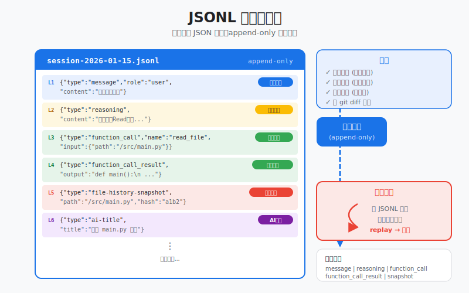
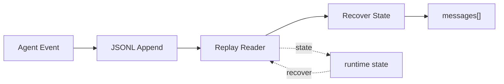

# s09: JSONL Transcript — 对话是流, 追加不覆盖, 崩了能回放

> *"对话是流, 追加不覆盖, 崩了能回放"* — append-only JSONL 会话持久化。
>
> **Harness 层**: 持久化 — 对话的源真相。

---



## 代码架构图



## 学习前置知识

- JSONL 是一行一个 JSON 事件, 适合追加写入。
- Transcript 是事实流, SQLite 更适合索引和查询。
- 崩溃恢复依赖事件边界清楚。

## 本章抓住的 WorkBuddy-style 机制

- 把用户消息、助手消息、工具调用、工具结果都写成事件。
- 通过 replay 重建会话上下文。
- 为 s21 的数据库分工打基础。

## 常见误区

- 只保存最终回答, 无法复盘工具调用和错误。
- 把大输出直接写入上下文, 会拖垮后续 prompt。
- JSONL 乱序或半行写入不处理, 恢复会不可靠。
## 问题

s11 解决了"用哪个模型"。现在模型能对话了，但对话内容存哪？

最直觉的答案：数据库。开一张 SQLite 表，每条消息一行，`INSERT` 进去。查的时候 `SELECT * FROM messages WHERE session_id = ?`。

听起来没问题。但考虑这些场景：

1. **崩溃恢复** — agent 正在跑，进程突然挂了。内存里的 `messages[]` 没了。数据库里的事务可能没 commit。你怎么知道最后一条完整的消息是什么？
2. **流式追加** — agent 的推理过程是一段一段吐出来的。你想边吐边存，不想等整条消息结束再 `INSERT`。数据库的行级更新需要先读再改再写。
3. **移植** — 用户想导出对话给别人看。一个 `.jsonl` 文件，每行一个 JSON，任何工具都能读。数据库要导出还得转格式。
4. **并发** — 一个会话一个文件，没有锁竞争。数据库要管连接池、锁、事务隔离。
5. **Schema 迁移** — 今天你加了 `reasoning` 字段，明天的工具调用格式变了。数据库要 `ALTER TABLE`，旧数据要迁移。JSONL 每行独立解析，新字段不影响旧行。

核心矛盾：**对话是流，不是表**。流的特点是只追加、不修改。数据库的 CRUD 模型在这种场景下是过度设计。

---

## 解决方案

```
┌──────────────────────────────────────────────────────────────────┐
│                      Session Process                              │
│                                                                  │
│   messages[] (in-memory)                                         │
│       │                                                          │
│       │ every event → append                                     │
│       ▼                                                          │
│   ~/.workbuddy/projects/<workspace>/<session>.jsonl              │
│   ┌────────────────────────────────────────────────┐            │
│   │ {"type":"message","role":"user","content":"..."}│  line 1   │
│   │ {"type":"reasoning","content":"Let me analyze"} │  line 2   │
│   │ {"type":"function_call","name":"read_file",...} │  line 3   │
│   │ {"type":"function_call_result","callId":"...",..}│  line 4   │
│   │ {"type":"file-history-snapshot","path":"main.py"}│  line 5   │
│   │ {"type":"message","role":"assistant","content":.}│  line 6   │
│   │ {"type":"ai-title","title":"Fix login bug"}     │  line 7   │
│   │ ...                                             │  (grows)  │
│   └────────────────────────────────────────────────┘            │
│       │                                                          │
│       │ crash? just read the file                                │
│       ▼                                                          │
│   replay(max_items=1000) → messages[] restored                   │
└──────────────────────────────────────────────────────────────────┘
```

WorkBuddy 的做法：**对话内容存 JSONL，元数据存 SQLite**。

- JSONL 是 append-only 的流——每个事件追加一行，永不修改
- SQLite 是 CRUD 的表——存会话列表、使用统计、自动化调度
- 崩了？读 JSONL 文件，回放事件，重建 `messages[]`

---

## 工作原理

### JSONL 文件结构

每个会话对应一个 `.jsonl` 文件：

```
~/.workbuddy/projects/
  ├── myproject/
  │   ├── session_abc123.jsonl    ← 这次的对话
  │   ├── session_def456.jsonl    ← 上次的对话
  │   └── session_ghi789.jsonl
  └── another-project/
      └── session_xyz000.jsonl
```

每行是一个独立的 JSON 对象，用 `\n` 分隔。没有外层数组包裹，没有文件头。第一行就是第一条事件，最后一行就是最新事件。

### 6 种事件类型

| JSONL `type` | 用途 | 对应 LLM messages[] |
|--------------|------|---------------------|
| `message` | 用户/助手消息 | `{"role": "user/assistant", "content": "..."}` |
| `reasoning` | 推理/思考过程 | 不直接映射（metadata） |
| `function_call` | 工具调用 | assistant 消息中的 `tool_use` block |
| `function_call_result` | 工具返回结果 | user 消息中的 `tool_result` block |
| `file-history-snapshot` | 文件状态快照 | 不映射（文件追踪用） |
| `ai-title` | 自动生成的会话标题 | 不映射（会话元数据） |

示例 JSONL 内容：

```jsonl
{"type":"message","role":"user","content":"fix the bug","timestamp":1709123456}
{"type":"reasoning","content":"Let me analyze the error...","timestamp":1709123457}
{"type":"function_call","name":"read_file","arguments":{"path":"main.py"},"callId":"call_001"}
{"type":"function_call_result","callId":"call_001","output":{"content":"..."}}
{"type":"file-history-snapshot","path":"main.py","hash":"abc123"}
{"type":"ai-title","title":"Fix login bug"}
```

前 3 种（message、reasoning、function_call）是 agent 思考链的三个阶段：用户提问 → 模型推理 → 模型行动。第 4 种（function_call_result）是行动的反馈。后 2 种（file-history-snapshot、ai-title）是系统级的元数据。

### 追加写入

写入只有一个操作：**追加一行**。没有更新，没有删除。

```python
def append(self, event: dict) -> None:
    if "timestamp" not in event:
        event["timestamp"] = int(time.time())
    with open(self.filepath, "a", encoding="utf-8") as f:
        f.write(json.dumps(event, ensure_ascii=False) + "\n")
```

`"a"` 模式保证：文件不存在就创建，存在就追加到末尾。操作系统级别的原子写入——要么整行写进去，要么一行都不写。崩溃时最多丢最后一行（写了一半的行），不会损坏已有数据。

这就是 "追加不覆盖" 的含义：**文件只长不缩，已有的行永不改变**。

### 会话回放 (replay <= 1000)

会话加载时，不需要把整个 JSONL 文件读进内存。WorkBuddy 设了一个上限：

```
CODEBUDDY_SESSION_MAX_ITEMS = 1000
```

回放策略：

```
                    JSONL File (may be very long)
    ┌──────────────────────────────────────────────────────┐
    │ line 1   {"type":"message",...}                     │
    │ line 2   {"type":"reasoning",...}                   │
    │ ...                                                 │
    │ line 995  {"type":"message",...}                    │
    │ line 996  {"type":"function_call",...}   ──┐        │
    │ line 997  {"type":"function_call_result".. │        │
    │ line 998  {"type":"message",...}           │ read   │
    │ line 999  {"type":"reasoning",...}         │ last   │
    │ line 1000 {"type":"message",...}           │ 1000   │
    │ line 1001 {"type":"ai-title",...}   ──────┘        │
    │ ...                                                 │
    └──────────────────────────────────────────────────────┘
                            │
                            ▼
              replay(max_items=1000)
                            │
                            ▼
                reconstructed messages[]
                 (last 1000 events)
```

```python
def replay(self, max_items=1000):
    events = self._read_all_events()
    recent = events[-max_items:]  # Take last N events

    messages = []
    for event in recent:
        msg = self._event_to_message(event)
        if msg:
            messages.append(msg)
    return messages
```

为什么 1000？一个典型的 agent 交互（用户消息 + 推理 + 工具调用 + 结果 + 回复）大约 5-10 个事件。1000 个事件 ≈ 100-200 轮交互，覆盖绝大多数会话。超长会话只加载最近的上下文，避免把整个历史塞进 LLM 的 context window。

### 崩溃恢复

```
1. Session process crashes
       │
       ▼
2. On restart: open <session>.jsonl
       │
       ▼
3. Read backwards (last N items)
       │
       ▼
4. Reconstruct messages[] from events
       │
       ▼
5. Resume agent loop
```

```python
def recover(self):
    events = self._read_all_events()
    messages = self.replay()

    # Also recover metadata
    title = None
    file_snapshots = []
    for event in events:
        if event.get("type") == "ai-title":
            title = event.get("title")
        elif event.get("type") == "file-history-snapshot":
            file_snapshots.append(...)

    return {
        "messages": messages,
        "title": title,
        "file_snapshots": file_snapshots,
        "total_events": len(events),
    }
```

崩溃恢复的关键：**JSONL 文件就是源真相**。不需要 WAL（Write-Ahead Log），不需要事务日志，不需要 binlog。文件本身就是日志。读它就行。

---

## JSONL vs SQLite 分工

WorkBuddy 同时用 JSONL 和 SQLite，但职责严格分开：

| 维度 | JSONL | SQLite |
|------|-------|--------|
| **用途** | 对话内容（源真相） | 元数据 & 索引 |
| **写入模式** | Append-only | CRUD（增删改查） |
| **恢复方式** | 回放文件 | 备份/恢复 |
| **查询方式** | 顺序扫描 | SQL 查询 |
| **内容** | 完整消息 + 工具调用 + 推理 | 会话列表、使用统计、自动化调度 |
| **文件** | 每会话一个 `.jsonl` | 单个 `.db` 文件 |
| **并发** | 无锁（每会话独立文件） | 连接池 + 锁 |
| **Schema** | 无（每行独立解析） | 表结构 + 迁移 |

```
         对话内容                          元数据
         ────────                          ──────
    ┌──────────────┐              ┌──────────────────┐
    │ session.jsonl│              │   workbuddy.db   │
    │              │              │                  │
    │ message      │              │ sessions table   │
    │ reasoning    │              │  (id, title,     │
    │ function_call│              │   cwd, status)   │
    │ result       │              │                  │
    │ snapshot     │              │ usage_stats      │
    │ ai-title     │              │  (tokens, cost)  │
    │              │              │                  │
    │ (source of   │              │ automations      │
    │  truth)      │              │  (schedule, rrule│
    └──────────────┘              │   prompt)        │
                                  └──────────────────┘
```

**原则**：能从 JSONL 重建的数据，不存 SQLite。SQLite 只存"无法从对话流推导"的东西——比如会话标题（虽然 `ai-title` 也在 JSONL 里，但 SQLite 存的是用户手动改过的标题）、自动化调度规则。

---

## 为什么选 JSONL

### 1. 简单

append-only，没有 schema 迁移。加一种新事件类型？直接写进去，旧代码遇到不认识的 `type` 就跳过。不需要 `ALTER TABLE`，不需要迁移脚本。

### 2. 崩溃恢复

不需要事务日志。文件本身就是日志。崩溃后读文件，跳过损坏的最后一行（`json.loads` 失败就 skip），其余数据完好。数据库要管 ACID、WAL、checkpoint，JSONL 只管追加。

### 3. 可移植

纯文本，每行一个 JSON。`cat session.jsonl | jq .` 就能看。`grep '"type":"function_call"' session.jsonl` 就能筛工具调用。要导出？`cp session.jsonl backup.jsonl`。要迁移？直接拷贝文件。

### 4. 反向扫描

可以只读文件末尾的 N 行，快速获取最近上下文。Linux 的 `tail -n 1000` 做的就是这件事。数据库要做同样的事，需要 `ORDER BY timestamp DESC LIMIT 1000`，还要走索引。

### 5. 无锁竞争

每个会话一个文件，一个进程写。不存在 A 会话锁住 B 会话的情况。数据库的表级锁、行级锁、连接池——在单会话场景下都是不必要的复杂度。

---

## WorkBuddy 架构对照

### 文件位置

```
~/.workbuddy/projects/<workspace>/<session_id>.jsonl
```

每个 workspace 一个目录，每个 session 一个 `.jsonl` 文件。文件名就是 session ID。

### 事件格式

WorkBuddy 的 JSONL 事件比教学版多了不少字段（流式 ID、UUID、模型信息等），但核心 `type` 字段一致：

```jsonl
{"type":"message","role":"user","content":"fix the bug","uuid":"a1b2c3","timestamp":1709123456}
{"type":"reasoning","content":"Let me analyze...","uuid":"d4e5f6","timestamp":1709123457}
{"type":"function_call","name":"read_file","arguments":{"path":"main.py"},"callId":"call_001","uuid":"g7h8i9"}
```

### 回放上限

```javascript
const CODEBUDDY_SESSION_MAX_ITEMS = 1000;
```

会话加载时，从 JSONL 文件末尾读取最多 1000 个事件，重建 `messages[]`。超出部分不加载——如果用户滚动到更早的历史，再按需读取。

### JSONL 写入时机

WorkBuddy 在 agent loop 的每个关键节点写入 JSONL：

```
用户发送消息     → append message event
模型开始推理     → append reasoning event
模型调用工具     → append function_call event
工具返回结果     → append function_call_result event
文件被修改       → append file-history-snapshot event
会话标题生成     → append ai-title event
```

每次 `append` 都是一次 `fs.writeFileSync`（或流式写入）。不批量、不缓冲——每个事件立即落盘。这保证了崩溃时最多丢一个正在写的事件。

---

## 代码 walkthrough

`code.py` 实现了一个完整的 JSONL 会话记录与恢复 demo：

1. **`JSONLTranscript` 类** — 核心，封装 JSONL 文件的追加、回放、恢复
   - `append(event)` — 追加一行 JSON，永不覆盖
   - `replay(max_items=1000)` — 从末尾取最近 N 个事件，重建 messages[]
   - `recover()` — 读取全部事件，恢复 messages[] + 元数据
   - `_event_to_message(event)` — 将 JSONL 事件转换为 LLM 消息格式

2. **`MockLLM` 类** — 模拟 LLM 的脚本化对话，演示全部 6 种事件类型

3. **`demo()` 函数** — 三幕演示：
   - Part 1: Agent 运行，所有事件追加到 JSONL
   - Part 2: 模拟崩溃，内存状态清空
   - Part 3: 从 JSONL 恢复，重建完整状态

---

## 运行

```bash
python s09_jsonl_transcript/code.py
```

观察重点：

- Part 1 中，每个事件追加后 JSONL 行数如何增长（`jsonl line: N`）
- Part 2 中，崩溃后内存清空，但 JSONL 文件仍在磁盘上
- Part 3 中，恢复后的 messages[] 是否与 Part 1 的一致
- 最后输出的原始 JSONL 文件——每行一个 JSON，可读、可 grep

---

## 练习

1. **截断回放**：修改 `replay()` 方法，使其在反向读取时遇到最后一个 `message` 类型且 `role=user` 的事件就停止。这意味着只恢复"最后一轮对话"的上下文，而非全部历史。
2. **损坏容错**：在 JSONL 文件中手动插入一行损坏的 JSON（如 `{"type":"message", broken`），验证 `_read_all_events()` 是否能跳过损坏行并继续恢复其余事件。
3. **会话分片**：当一个 JSONL 文件超过 10000 行时，自动创建新文件（如 `session_abc123_2.jsonl`），并在 SQLite 中记录分片信息。实现这个分片逻辑。

---

## 下一课

对话存好了，JSONL 文件让每条消息都持久化在磁盘上。但 agent 做完事就忘了——下次打开同一项目，之前修了什么 bug、为什么这么改，全不知道。s10 讲工作区记忆——每天的工作日志，追加不覆盖。

s10 Workspace Memory → 日志追加、主题蒸馏、30 天保留。
