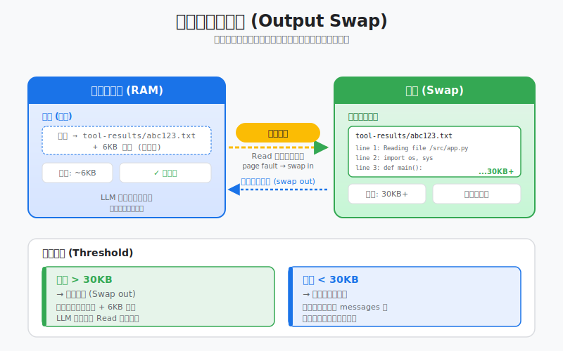
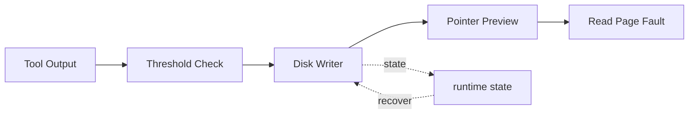

# s13: Tool Output Externalization — 内存不够, 换到磁盘

> *"内存不够, 换到磁盘 — 上下文是内存, 磁盘是外存"* — 工具输出外部化。
>
> **Harness 层**: 上下文管理 — 虚拟内存换页机制。

---



## 代码架构图



## 学习前置知识

- 工具输出可能比模型上下文还大。
- 上下文里应保存摘要和指针, 原文放磁盘或对象存储。
- 外部化需要可追溯, 否则模型找不回细节。

## 本章抓住的 WorkBuddy-style 机制

- 把大输出 swap 到 artifact 文件, prompt 里只留摘要和路径。
- 模拟按需读取片段, 类似缺页中断。
- 为 s14 的压缩减轻压力。

## 常见误区

- 把全部工具输出塞回 messages, 很快耗尽窗口。
- 只保留文件路径不保留摘要, 模型不知道何时读取。
- 外部化文件不纳入审计, 会影响复盘。
## 问题

一条 `grep -r "TODO" .` 命令能产生多少输出？

在一个中等规模的项目里，可能是几百 KB。在一个大型 monorepo 里，可能是几 MB。如果 agent 在 `/` 根目录下搜——50 MB 不夸张。

模型的上下文窗口是 128K token，大约 500 KB 文本。**一条命令的输出就能把上下文撑爆十倍。**

这不是边缘情况。一个真正干活的 agent——读文件、跑测试、搜索代码——每一步工具调用都在往上下文里灌数据。`grep` 返回 50 MB、`pytest -v` 返回 20 MB、`cat large_file.json` 返回 100 MB——任何一个都能让后续对话直接崩溃。

你不能不让 agent 用这些工具——它需要搜索、需要读文件、需要跑命令。你也不能简单截断输出——agent 可能正好需要第 40000 行的那个错误信息。你需要的是：**完整输出不丢，但上下文不被撑爆。**

---

## 解决方案

```
工具执行
    │
    ▼
┌──────────────────────┐
│ 输出 > 阈值?          │
└──────────┬───────────┘
      No   │   Yes
      │    │    │
      ▼    │    ▼
  直接放    │  ┌─────────────────────────┐
  进上下文  │  │ 写入磁盘:                │
            │  │   tool-results/         │
            │  │     tool_result_001.txt │
            │  │     (完整输出)           │
            │  └──────────┬──────────────┘
            │             │
            │             ▼
            │  ┌─────────────────────────┐
            │  │ 上下文中放指针:          │
            │  │   head 6KB              │
            │  │   ... (省略) ...         │
            │  │   tail 24KB             │
            │  │   [full output at: path]│
            │  └──────────┬──────────────┘
            │             │
            ▼             ▼
       上下文只增长 ~原始大小    上下文只增长 ~30KB
```

把工具的完整输出写到磁盘文件，上下文里只保留一个**指针 + 预览**。这和操作系统的虚拟内存换页是同一个思想——物理内存（上下文窗口）不够时，把数据换到磁盘（`tool-results/*.txt`），内存里只留一个页表条目（指针）。

| 概念 | 操作系统 | WorkBuddy |
|------|---------|-----------|
| 内存 | RAM | 上下文窗口 |
| 外存 | 磁盘 swap | `tool-results/*.txt` |
| 内存条目 | 页表条目 | 指针 + 预览 |
| 读回数据 | 缺页中断 | Read 工具 |

---

## 工作原理

### 阈值检测

不同工具有不同的阈值——Bash 输出波动大（可能几字节，可能几 MB），阈值高一些；其他工具输出相对可控，阈值低一些：

```python
BASH_MAX_OUTPUT_LENGTH = 30000        # chars — Bash 输出超过此值 → 外部化
CODEBUDDY_TOOL_RESULT_THRESHOLD_KB = 50  # KB — 非 Bash 工具超过此值 → 外部化
```

Bash 外部化后，上下文中保留 **head 6KB + tail 24KB ≈ 30KB** 的截断版本。为什么 head + tail 而不是只留 head？因为很多命令的关键信息在末尾——编译错误的最后几行、测试结果的 summary、命令的退出状态。

```python
def should_externalize(self, output: str, tool_name: str) -> bool:
    if tool_name == "bash":
        return len(output) > BASH_MAX_OUTPUT_LENGTH
    else:
        return len(output.encode("utf-8")) > CODEBUDDY_TOOL_RESULT_THRESHOLD_KB * 1024
```

### 磁盘写入

超过阈值的输出写入会话目录下的 `tool-results/` 文件夹，按序编号：

```
~/.workbuddy/projects/<workspace>/<session>/
└── tool-results/
    ├── tool_result_001.txt    # 第 1 次外部化的完整输出
    ├── tool_result_002.txt    # 第 2 次外部化的完整输出
    ├── tool_result_003.txt
    └── ...
```

```python
def write_to_disk(self, output: str, session_dir: Path) -> Path:
    tool_results_dir = session_dir / "tool-results"
    tool_results_dir.mkdir(parents=True, exist_ok=True)

    # Find next available number
    existing = list(tool_results_dir.glob("tool_result_*.txt"))
    next_num = len(existing) + 1

    file_path = tool_results_dir / f"tool_result_{next_num:03d}.txt"
    file_path.write_text(output, encoding="utf-8")
    return file_path
```

### 上下文替换 (pointer + preview)

外部化后，上下文中的 `tool_result` 内容被替换为截断版本 + 文件路径：

```python
def make_pointer(self, output: str, file_path: Path) -> str:
    head = output[:6 * 1024]       # First 6KB
    tail = output[-24 * 1024:]     # Last 24KB
    size = len(output.encode("utf-8"))

    return (
        f"{head}\n"
        f"\n... [{size - 30000} characters omitted, "
        f"full output at: {file_path}] ...\n"
        f"\n{tail}"
    )
```

Agent 看到的是：开头 6KB 预览 + 省略提示 + 末尾 24KB 预览 + 磁盘路径。它知道完整输出在哪，需要时可以用 Read 工具取回。

### 按需读取 (Read = 缺页中断)

当 agent 发现预览里有关键信息被省略了，它调用 Read 工具读取磁盘上的完整文件——这就是**缺页中断**：

```
Agent 上下文                           磁盘
┌─────────────────────┐               ┌──────────────────────┐
│ tool_result:         │               │ tool_result_001.txt  │
│   head 6KB ...       │               │ (50MB 完整输出)       │
│   [full at: path]    │── Read ──▶    │                      │
│   ... tail 24KB      │               │                      │
│                      │◀──content──   │                      │
│ Read result:         │               │                      │
│   line 40000: ERROR  │               │                      │
└─────────────────────┘               └──────────────────────┘
       ~30KB                              不进上下文
```

```python
def read_from_disk(self, file_path: Path, offset: int = 0, limit: int = 2000) -> str:
    """Page fault handler — bring data back from disk on demand."""
    content = file_path.read_text(encoding="utf-8")
    lines = content.split("\n")
    selected = lines[offset:offset + limit]
    return "\n".join(selected)
```

---

## OS 类比: 虚拟内存换页

这不是比喻——这就是虚拟内存换页，只是应用到了 LLM 上下文管理上。

| OS 概念 | WorkBuddy 对应 | 说明 |
|---------|---------------|------|
| 物理内存 (RAM) | 上下文窗口 | 有限、快、贵——128K token |
| 磁盘 swap 区 | `tool-results/*.txt` | 无限、慢、便宜 |
| 页表条目 | 指针 + 预览 | 小巧，指向实际数据位置 |
| 缺页中断 (page fault) | Read 工具读磁盘文件 | 按需把数据从磁盘取回上下文 |
| 按需分页 (demand paging) | 工具输出外部化 + 按需 Read | 数据不主动加载，用到时才读 |
| 进程隔离 | SubAgent 独立上下文 | 子 Agent 的上下文不污染主 Agent |
| 异步 I/O | 后台任务机制 | 长任务转后台，不阻塞上下文 |
| 内存回收 / GC | compact + auto compact | 上下文满了做压缩（s18） |
| 文件系统 | 三层记忆系统 | 云端 → 用户级 → 工作区 |
| 进程回放上限 | 会话回放 ≤ 1000 条 | 防止历史回放耗尽内存 |

**一句话**：上下文是 RAM，磁盘是 swap，Read 是 page fault handler。

---

## 三层防线框架

上下文管理是一个三层防线体系——本章节是**第一层（入口控制）**：

```
┌─────────────────────────────────────────────────────────┐
│ Layer 1: 入口控制 (本章 s17)                              │
│   ├─ 工具输出外部化 (大输出 → 磁盘, 上下文只留指针)        │
│   ├─ 延迟工具加载 (schema 按需加载, s04)                  │
│   ├─ 后台任务隔离 (长任务转后台, 不占上下文)              │
│   └─ SubAgent 上下文隔离 (子 Agent 独立上下文)            │
│                                                         │
│   策略: 从一开始就不让大东西进入上下文 (预防式)            │
├─────────────────────────────────────────────────────────┤
│ Layer 2: 主动压缩 (s18)                                   │
│   ├─ pre-message compact (10% 阈值, 消息前压缩)          │
│   └─ auto compact (70-92% 阈值, 自动压缩)                │
│                                                         │
│   策略: 上下文太大了就压缩 (治疗式)                        │
├─────────────────────────────────────────────────────────┤
│ Layer 3: 持久化扩展 (s14-s16)                             │
│   ├─ 云端记忆 (用户画像, 服务端检索)                      │
│   ├─ 用户级记忆 (MEMORY.md, 手动偏好)                     │
│   └─ 工作区记忆 (每日日志, 只追加)                        │
│                                                         │
│   策略: 不需要的上下文放到外部存储, 按需取回               │
└─────────────────────────────────────────────────────────┘
```

**第一层是最高优先级**——因为它在数据进入上下文之前就拦截，ROI 最高。一条 grep 命令省下的 50MB，比压缩 50MB 已有上下文容易得多。

---

## 为什么比智能记忆更优先

> *"复刻时这层比'智能记忆'更优先，因为它直接决定长任务能不能跑下去"*

四个原因：

**1. 直接决定长任务能不能跑下去**

智能记忆（s14-s16）解决的是"记住什么"的问题。输出外部化解决的是"能不能继续跑"的问题。一个 agent 如果连第二回合都撑不过去（因为第一条 grep 命令把上下文撑爆了），再聪明的记忆系统也没用。

```
没有输出外部化:
  Turn 1: grep → 50MB → 上下文爆 → 💥 API 报错 → 任务终止

有输出外部化:
  Turn 1: grep → 50MB → 外部化 → 上下文 +30KB → 继续跑
  Turn 2: pytest → 20MB → 外部化 → 上下文 +30KB → 继续跑
  Turn 3: cat → 100MB → 外部化 → 上下文 +30KB → 继续跑
  ...
  Turn 50: 上下文还没满 → 任务完成 ✅
```

**2. 是第一道防线——防止上下文被填满**

压缩（s18）是治疗——上下文已经满了才触发。外部化是预防——大输出从一开始就不进上下文。预防永远比治疗便宜。

**3. 实现比 AI 驱动的记忆选择简单得多**

memorySelector（s16）需要调一个 lite 模型做相关性判断——涉及模型调用、prompt 工程、JSON 解析。输出外部化只需要一个长度判断 + 文件写入——纯逻辑，零模型调用。

**4. ROI 立竿见影**

一条 grep 命令就能省 50MB 上下文。实现只需要几十行代码。没有比这更高 ROI 的上下文管理策略了。

---

## WorkBuddy 架构对照

### 环境变量与阈值

生产级桌面 agent 的输出外部化由两个环境变量控制：

```bash
# Bash 输出超过此长度 → 写磁盘, 上下文留 head+tail
BASH_MAX_OUTPUT_LENGTH=30000

# 非 Bash 工具结果超过此大小 → 写磁盘, 上下文留占位符
CODEBUDDY_TOOL_RESULT_THRESHOLD_KB=50
```

### 磁盘文件结构

```
~/.workbuddy/projects/<workspace-hash>/<session-id>/
└── tool-results/
    ├── tool_result_001.txt
    ├── tool_result_002.txt
    └── ...
```

每次外部化写入一个编号递增的文件。文件路径记录在上下文中的 `tool_result` 里，agent 可以通过 Read 工具按需读取。

### Bash 输出的 head + tail 策略

Bash 工具的外部化保留了 head 6KB + tail 24KB，而不是简单的截断前 30KB：

```javascript
// agent bridge 中的 Bash 输出处理 (简化)
if (output.length > BASH_MAX_OUTPUT_LENGTH) {
    const head = output.slice(0, 6 * 1024);
    const tail = output.slice(-24 * 1024);
    const filePath = writeToolResultToDisk(output, sessionDir);

    // Replace context with pointer
    toolResult.content = (
        head + "\n" +
        `[... omitted, full output at: ${filePath} ...]\n" +
        tail
    );
}
```

为什么 head + tail？因为命令输出的关键信息分布不均匀：
- **head**：命令本身、环境信息、开头的结果
- **tail**：错误摘要、统计信息、退出状态、最终结论

中间往往是大量重复性数据（比如几千行日志），省略它们不影响 agent 理解全局。

### 非 Bash 工具的占位符策略

非 Bash 工具（如 MCP 工具返回大量结构化数据）超过 50KB 时，上下文中只留一个占位符 + 预览 + 文件路径：

```javascript
// 非 Bash 工具结果处理 (简化)
if (resultSize > CODEBUDDY_TOOL_RESULT_THRESHOLD_KB * 1024) {
    const filePath = writeToolResultToDisk(result, sessionDir);
    toolResult.content = (
        `[Output externalized to: ${filePath}]\n` +
        `Preview: ${result.slice(0, 2048)}...\n` +
        `Use Read tool to access full content.`
    );
}
```

### 与后台任务的协作

当 Bash 命令的输出被外部化后，如果命令仍在后台运行（`run_in_background=true`），外部化的文件会持续被追加。Agent 可以通过 `TaskOutput` 工具按需读取最新内容——这也是一种"按需分页"。

---

## 代码 walkthrough

`code.py` 实现了完整的输出外部化机制：

1. **`ToolResultExternalizer`** — 核心类
   - `should_externalize(output, tool_name)` — 判断是否需要外部化（Bash: 30000 chars, 其他: 50KB）
   - `write_to_disk(output, session_dir)` — 写入 `tool-results/tool_result_NNN.txt`
   - `make_pointer(output, file_path)` — 生成 head 6KB + tail 24KB + 路径指针
   - `read_from_disk(file_path, offset, limit)` — 缺页中断处理：从磁盘按需读取

2. **`MockLLM`** — 模拟 LLM 的行为
   - 按预设脚本生成工具调用
   - 看到外部化指针时，决定是否触发"缺页中断"（调 Read 读完整输出）

3. **Agent 循环** — 集成外部化
   - 工具执行后检查是否需要外部化
   - 需要则写磁盘 + 替换上下文内容
   - 打印 `[externalize]` 日志，显示节省效果

4. **Demo 场景** — 完整演示
   - 模拟一条产生 1.3MB 输出的 grep 命令
   - 展示外部化前后的上下文大小对比
   - 模拟 agent 需要完整输出时的缺页中断

运行后会看到类似日志：
```
[externalize] tool_result_001.txt written, 1.3MB → 2KB in context (saved 99.8%)
[page-fault]  agent requested full output, reading tool_result_001.txt from disk
```

---

## 运行

```bash
python s13_output_externalization/code.py
```

代码使用 mock LLM，无需 API key。运行后会自动演示：
1. 一条大输出命令触发外部化
2. 上下文只增长 ~30KB（而非 1.3MB）
3. Agent 需要完整输出时触发缺页中断
4. 从磁盘读取特定行段

---

## 练习

1. 当前 `make_pointer` 保留 head 6KB + tail 24KB。如果 agent 最常需要的是输出的中间部分（比如第 40000 行的错误），怎么改进预览策略？提示：考虑基于正则匹配的关键行提取，或分块索引。
2. 给 `ToolResultExternalizer` 加一个清理机制：会话结束时删除 `tool-results/` 目录。但如果 agent 在新会话中需要引用旧会话的外部化输出呢？思考：跨会话的外部化文件应该怎么管理？
3. 当前的 `should_externalize` 只看输出大小。如果一条命令的输出是 30KB 的随机字符串（对 agent 无用）vs 30KB 的结构化 JSON（每行都有用），应该用不同策略吗？思考：能否让外部化策略感知输出的信息密度？

---

## 下一课

入口控制（本章）防止大输出进入上下文。但对话本身会越来越长——即使每条工具结果都外部化了，50 轮对话的消息历史仍然会填满上下文窗口。上下文满了怎么办？s14 讲上下文压缩——四层压缩管线。

s14 Context Compact → 四层压缩管线, 保最新、弃最旧、留摘要。
