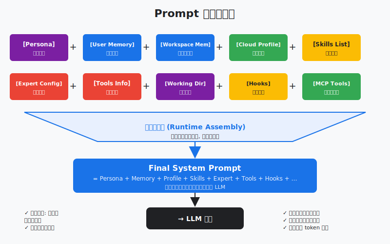
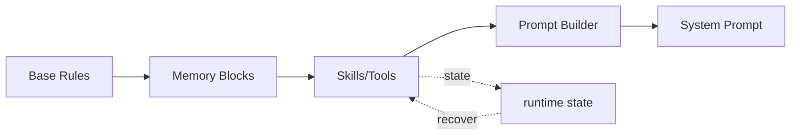

# s15: Prompt Assembly — prompt 是组装出来的, 不是写死的

> *"prompt 是组装出来的, 不是写死的"* — 运行时分段拼接 + 身份注入。
>
> **Harness 层**: 上下文管理 — 系统提示的运行时组装。

---



## 代码架构图



## 学习前置知识

- System prompt 应该是运行时组装物, 不是一个巨型静态字符串。
- 每个上下文块都要有来源、优先级和预算。
- Prompt 组装是 context engineering 的最后一公里。

## 本章抓住的 WorkBuddy-style 机制

- 把 persona、memory、profile、skills、tools、hooks 作为片段按条件组装。
- 演示预算裁剪和重新组装触发。
- 连接 s10-s14 的记忆/压缩结果。

## 常见误区

- 把所有配置常驻 prompt, 会造成隐性 token 税。
- 片段没有优先级, 裁剪时容易删掉安全规则。
- 运行中状态变化后不重组装, 模型会拿过期上下文工作。
## 问题

很多人以为系统提示就是一段写死的文字——"你是一个有用的助手"开头，加几条规则，完事。但在真实的 agent harness 里，系统提示是一个**动态拼装的产物**。

WorkBuddy 的系统提示可能有 100KB+。它包含：基础指令、身份文件内容、云端记忆、项目上下文、工具描述、专家指令、技能指令、连接器状态、区域约定、工作模式。这些片段**不是每次都一样**——加载了新技能，技能指令就加进去；切换了专家，专家指令就换一份；用户切换工作模式，相关约束就变。

如果系统提示是写死的字符串，你无法做到这些。你需要一个**分段组装机制**：每个片段独立维护，按条件包含，运行时拼接。

---

## 解决方案

系统提示不是一个字符串，而是一组**片段（segments）**的有序拼接：

| # | 片段 | 来源 | 条件 |
|---|------|------|------|
| 1 | 基础指令 | 硬编码 | 始终包含 |
| 2 | 身份注入 | persona/core.md / persona/identity.md / persona/user.md | 文件存在时 |
| 3 | 云端记忆 | `<memory>` 块 (s12) | Profile 非空时 |
| 4 | 项目上下文 | 文件结构、工作目录 | 始终包含 |
| 5 | 工具描述 | 从注册工具动态生成 | 有工具时 |
| 6 | 专家指令 | 激活的专家包 | 专家激活时 |
| 7 | 技能指令 | 已加载技能的 SKILL.md | 技能加载时 |
| 8 | 连接器状态 | 可用 MCP 连接器 | 有连接器时 |
| 9 | 区域约定 | 股市颜色、货币符号 | 按区域 |
| 10 | 工作模式 | craft / plan / ask | 按模式 |

```
运行时组装:

  ┌──────────┐  ┌──────────┐  ┌──────────┐  ┌──────────┐
  │ 基础指令  │  │ 身份注入  │  │ 云端记忆  │  │ 项目上下文│
  │ (always) │  │ (if file)│  │ (if mem) │  │ (always) │
  └────┬─────┘  └────┬─────┘  └────┬─────┘  └────┬─────┘
       │              │              │              │
       ▼              ▼              ▼              ▼
  ┌─────────────────────────────────────────────────────┐
  │                   拼接器 (joiner)                    │
  └──────────────────────┬──────────────────────────────┘
                         │
       ┌─────────────────┼──────────────────┐
       ▼                 ▼                  ▼
  ┌──────────┐  ┌──────────┐  ┌──────────┐  ┌──────────┐
  │ 工具描述  │  │ 专家指令  │  │ 技能指令  │  │ 工作模式  │
  │ (dynamic)│  │ (if exp) │  │ (if skill)│  │ (always) │
  └──────────┘  └──────────┘  └──────────┘  └──────────┘
                         │
                         ▼
              ┌─────────────────────┐
              │  最终系统提示 (100KB+)│
              └─────────────────────┘
```

---

## 工作原理

### 片段定义

每个片段是一个函数，返回字符串（或 None 表示不包含）：

```python
class PromptSegment:
    """系统提示的一个片段。"""
    def __init__(self, name: str, builder, condition=None):
        self.name = name        # 片段名 (用于调试)
        self.builder = builder  # 构建函数 -> str | None
        self.condition = condition or (lambda: True)

    def build(self) -> str | None:
        if not self.condition():
            return None
        return self.builder()
```

### 片段实现示例

```python
def build_base_instructions() -> str:
    """基础指令 — 始终包含。"""
    return f"""你是一个桌面 AI 助手。
工作目录: {WORKDIR}

核心规则:
- 使用工具解决问题, 不要只说不做
- 遵循权限系统 (s04)
- 工具执行前后有 hooks 扩展点"""

def build_identity() -> str | None:
    """身份注入 — 读取 SOUL/IDENTITY/USER 文件。"""
    parts = []
    for name, path in [("SOUL", "~/.workbuddy/persona/core.md"),
                       ("IDENTITY", "~/.workbuddy/persona/identity.md"),
                       ("USER", "~/.workbuddy/persona/user.md")]:
        p = Path(path).expanduser()
        if p.exists():
            parts.append(f"## {name}\n{p.read_text().strip()}")
    return "\n\n".join(parts) if parts else None

def build_cloud_memory() -> str | None:
    """云端记忆 — 来自 s12 的 Profile 注入。"""
    profile = load_cloud_profile()
    if not profile:
        return None
    return f"<memory>\n{profile}\n</memory>"

def build_tool_descriptions() -> str:
    """工具描述 — 从注册工具动态生成。"""
    if not TOOLS:
        return ""
    lines = ["## 可用工具"]
    for tool in TOOLS:
        lines.append(f"- {tool['name']}: {tool['description']}")
    return "\n".join(lines)
```

### 条件包含

有些片段只在特定条件下才包含：

```python
def build_expert_instructions() -> str | None:
    """专家指令 — 只有激活了专家时才包含。"""
    if not active_expert:
        return None
    return f"## 专家: {active_expert['name']}\n{active_expert['instructions']}"

def build_skill_instructions() -> str | None:
    """技能指令 — 加载了技能时才包含。"""
    if not loaded_skills:
        return None
    parts = []
    for skill in loaded_skills:
        parts.append(f"## 技能: {skill['title']}\n{skill['content']}")
    return "\n\n".join(parts)
```

### 拼接

```python
def assemble_system_prompt() -> str:
    """运行时组装系统提示。"""
    segments = [
        PromptSegment("base", build_base_instructions),
        PromptSegment("identity", build_identity),
        PromptSegment("memory", build_cloud_memory),
        PromptSegment("project", build_project_context),
        PromptSegment("tools", build_tool_descriptions),
        PromptSegment("expert", build_expert_instructions,
                      condition=lambda: active_expert is not None),
        PromptSegment("skills", build_skill_instructions,
                      condition=lambda: len(loaded_skills) > 0),
        PromptSegment("mode", build_work_mode),
    ]

    parts = []
    for seg in segments:
        content = seg.build()
        if content:
            parts.append(content)

    return "\n\n---\n\n".join(parts)
```

### 重新组装的时机

系统提示**不是每次 API 调用都重新组装**——那样太浪费。它在以下事件发生时重新组装：

| 事件 | 影响的片段 |
|------|-----------|
| 会话启动 | 全部 |
| 加载新技能 | 技能指令 |
| 切换专家 | 专家指令 |
| 切换工作模式 | 工作模式 |
| 连接器上线/下线 | 连接器状态 |
| 用户修改身份文件 | 身份注入 |

```python
def on_skill_loaded(skill):
    """技能加载后, 重新组装系统提示。"""
    loaded_skills.append(skill)
    global SYSTEM_PROMPT
    SYSTEM_PROMPT = assemble_system_prompt()
    print(f"[prompt] 重新组装, 新长度: {len(SYSTEM_PROMPT)} 字符")
```

---

## WorkBuddy 架构对照

生产级桌面 agent 的系统提示组装是 `agent bridge` 中的核心流程。它的片段比教学版更多：

### 组装流程

```javascript
// agent bridge 中的系统提示组装 (简化)
function assembleSystemPrompt(context) {
    const segments = [];

    // 1. 基础指令 — agent loop 规则, 工具使用指南
    segments.push(BASE_INSTRUCTIONS);

    // 2. 身份注入 — persona/core.md, persona/identity.md, persona/user.md, persona/bootstrap.md
    const identity = readIdentityFiles();
    if (identity) segments.push(identity);

    // 3. 云端记忆 — <memory> 块 (s12)
    if (context.cloudProfile) {
        segments.push(`<memory>\n${context.cloudProfile}\n</memory>`);
    }

    // 4. 项目上下文 — 文件结构, git 状态, CODEBUDDY.md
    segments.push(buildProjectContext(context.workdir));

    // 5. 工具描述 — 从注册工具动态生成
    segments.push(buildToolSection(context.tools));

    // 6. 专家指令 — 激活的专家包内容
    if (context.activeExpert) {
        segments.push(context.activeExpert.instructions);
    }

    // 7. 技能指令 — 已加载技能的 SKILL.md
    for (const skill of context.loadedSkills) {
        segments.push(skill.content);
    }

    // 8. 连接器状态 — 可用 MCP 连接器及其工具
    if (context.connectors.length > 0) {
        segments.push(buildConnectorStatus(context.connectors));
    }

    // 9. 区域约定 — 股市颜色, 货币符号, 日期格式
    segments.push(buildRegionalConventions(context.region));

    // 10. 工作模式 — craft / plan / ask
    segments.push(buildWorkModeInstructions(context.mode));

    return segments.join('\n\n---\n\n');
}
```

### 身份文件

WorkBuddy 的身份系统由四个文件组成：

| 文件 | 内容 | 作用 |
|------|------|------|
| `persona/core.md` | 核心人格、价值观 | 定义 agent "是谁" |
| `persona/identity.md` | 名字、角色、语气 | 定义 agent "叫什么" |
| `persona/user.md` | 用户信息、偏好 | 定义 "服务谁" |
| `persona/bootstrap.md` | 初始化引导 | 首次使用时的引导 |

这些文件在 `~/.workbuddy/` 下，用户可编辑。每次组装时读取最新内容。

### 重新组装的触发

```javascript
// 事件驱动重新组装
eventBus.on('skill:loaded', () => reassemble());
eventBus.on('expert:changed', () => reassemble());
eventBus.on('mode:switched', () => reassemble());
eventBus.on('connector:status', () => reassemble());
eventBus.on('identity:changed', () => reassemble());
```

系统提示组装后缓存，直到下一个触发事件才重新组装。

---

## 代码 walkthrough

`code.py` 演示了系统提示的分段组装：

1. **`PromptSegment` 类** — 每个片段有名字、构建函数、条件函数
2. **10 个片段构建器** — 模拟 WorkBuddy 的全部片段类型
3. **`assemble_system_prompt()`** — 遍历片段，条件检查，拼接
4. **重新组装触发** — 演示加载技能、切换专家、切换模式时重新组装
5. **agent 循环** — 使用组装好的系统提示，支持运行时重新组装

运行后可以输入 `prompt` 查看当前系统提示的结构，输入 `skill` 模拟加载技能（触发重新组装），输入 `expert` 模拟切换专家。

---

## 运行

```bash
python s15_prompt_assembly/code.py
```

---

## 练习

1. 加一个 `build_codebuddy_md()` 片段——读取工作目录下的 `CODEBUDDY.md` 文件，如果存在就注入项目级指令。思考：这个片段和身份注入有什么区别？
2. 实现片段优先级——某些片段（如基础指令）必须在最前面，某些（如工作模式）必须在最后面。给 `PromptSegment` 加一个 `priority` 字段。
3. 系统提示可能很大。实现一个 token 预算机制——如果总长度超过预算，优先截断低优先级片段。思考：哪些片段绝对不能截断？

---

## 下一课

系统提示组装好了，工具和身份都注入了。但 agent 还需要一种能力——按需加载扩展知识。不是所有知识都要一开始就塞进提示里，而是用到时才展开。

s16 Skills System → SKILL.md frontmatter, 按需加载。
