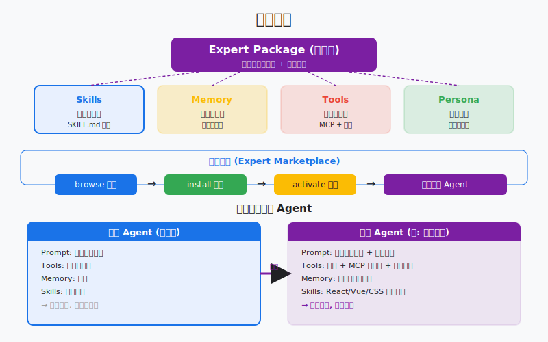
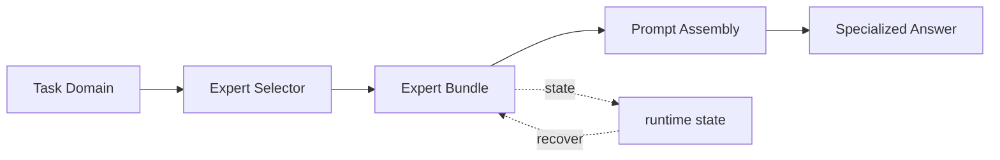

# s18: Experts System — 领域专家, 整包加载

> *"领域专家, 整包加载"* — Skills 加的是能力，Experts 改的是人格。整包加载，重塑 agent 的领域认知。
>
> **Harness 层**: 扩展生态 — agent 的领域知识系统。

---



## 代码架构图



## 学习前置知识

- Expert 是领域工作包, 不是另一个随机 prompt。
- 一个专家通常打包 persona、memory、tools、skills 和输出规范。
- 专家切换要改变上下文, 也要改变工具和风险边界。

## 本章抓住的 WorkBuddy-style 机制

- 把领域专家作为高层 routing 目标。
- 展示专家包如何影响 prompt assembly 和 tool pool。
- 连接 s08 模型路由与 s16/s17 扩展系统。

## 常见误区

- 只改称呼不改工具和记忆, 不是真专家。
- 专家过多没有路由标准, 用户会迷路。
- 专家包绕过权限系统, 会造成安全漏洞。
## 问题

s16 的 Skills 系统让 agent 按需加载单个技能。s17 的 MCP 连接器让 agent 接入外部工具。但这两者都是"增量"——它们给 agent 加了一个工具或一个技能，不改变 agent 的基本行为模式。

如果你需要 agent 像一个软件公司的技术总监那样思考呢？如果用户想让 agent 以 UI 设计师的视角审查界面呢？如果任务是做行业趋势研究，需要一整套研究方法论而不只是一个工具？

这不是"加一个技能"能解决的。你需要的是改变 agent 的"人格"——它的系统提示、它的工具配置、它的默认行为模式、它的知识背景。单个技能是一滴水，领域专家是一整片海。

WorkBuddy 的 Experts 系统解决这个问题。一个专家包不是单个技能，而是一整套领域知识的打包：专门的系统提示、工具配置、技能包、行为准则。选中一个专家，agent 的整个认知框架就变了。

---

## 解决方案

```
              Expert Package Structure
              
  ┌────────────────────────────────────────┐
  │           Expert Package               │
  │                                        │
  │  ┌──────────────────────────────────┐  │
  │  │ system_prompt_specialization     │  │  ← 重塑 agent 人格
  │  │ "You are a senior software       │  │
  │  │  architect at a tech company..." │  │
  │  └──────────────────────────────────┘  │
  │                                        │
  │  ┌──────────────────────────────────┐  │
  │  │ tool_configurations              │  │  ← 领域特定工具
  │  │ preferred_tools: [arch, uml]     │  │
  │  │ disabled_tools: [casual_chat]    │  │
  │  └──────────────────────────────────┘  │
  │                                        │
  │  ┌──────────────────────────────────┐  │
  │  │ skill_bundles                    │  │  ← 打包的技能集
  │  │ [code_review, arch_design,       │  │
  │  │  tech_doc, api_design]           │  │
  │  └──────────────────────────────────┘  │
  │                                        │
  │  ┌──────────────────────────────────┐  │
  │  │ behavior_guidelines              │  │  ← 行为准则
  │  │ - Always consider scalability    │  │
  │  │ - Prefer documented patterns     │  │
  │  └──────────────────────────────────┘  │
  └────────────────────────────────────┘


         Skills vs Experts
         ─────────────────
  
  Skill:  加一个能力 (点)        "我能做代码审查了"
  Expert: 换一个人格 (面)        "我是软件架构师"
```

| 维度 | Skills (s16) | Experts (s18) |
|------|-------------|---------------|
| 粒度 | 单个能力 | 整个领域 |
| 加载方式 | 按需触发 | 会话级激活 |
| 影响范围 | 单次调用 | 整个会话的人格 |
| 系统提示 | 追加技能说明 | 替换/增强核心提示 |
| 工具配置 | 不改变 | 可能启用/禁用特定工具 |
| 持久化 | 临时加载 | session 元数据中记录 |
| 数量 | 单次可用多个 | 单次通常激活一个 |

---

## 工作原理

### 专家包结构

```python
@dataclass
class ExpertPackage:
    """A domain expert package."""
    expert_id: str          # 唯一标识
    name: str               # 显示名称
    category: str           # 分类
    system_prompt: str      # 专门的系统提示
    tools_config: dict      # 工具配置
    skill_bundles: list     # 打包的技能
    guidelines: list        # 行为准则
    description: str        # 简短描述
```

### 专家加载与缓存

```python
EXPERTS_CACHE = Path.home() / ".workbuddy" / "app" / "cache" / "experts" / "metadata.json"

def load_expert(expert_id: str) -> ExpertPackage:
    """Load an expert package from cache or marketplace."""
    cache = json.loads(EXPERTS_CACHE.read_text()) if EXPERTS_CACHE.exists() else {}
    
    if expert_id not in cache:
        # Fetch from marketplace
        cache[expert_id] = fetch_from_marketplace(expert_id)
        EXPERTS_CACHE.write_text(json.dumps(cache, indent=2))
    
    return ExpertPackage(**cache[expert_id])
```

### 系统提示注入

当一个专家被激活时，其专门的系统提示会注入到 agent 的系统提示中：

```python
def build_system_prompt(base_prompt: str, expert: ExpertPackage | None) -> str:
    """Build system prompt with optional expert specialization."""
    if not expert:
        return base_prompt
    
    return f"""{base_prompt}

<expert_specialization>
You are now operating as: {expert.name}

{expert.system_prompt}

<behavior_guidelines>
{chr(10).join(f'- {g}' for g in expert.guidelines)}
</behavior_guidelines>
</expert_specialization>"""
```

### 会话级持久化

专家选择记录在会话元数据中：

```python
# sessions 表中的 expert_id 字段
session = {
    "session_id": "abc123",
    "expert_id": "SoftwareCompany",  # 当前激活的专家
    "created_at": "...",
    # ...
}
```

当用户重新打开一个会话时，系统会读取 `expert_id` 并重新加载对应的专家包。

### 专家切换

```python
def switch_expert(session_id: str, new_expert_id: str):
    """Switch the active expert for a session."""
    old_expert = get_session_expert(session_id)
    new_expert = load_expert(new_expert_id)
    
    # Update session metadata
    update_session(session_id, expert_id=new_expert_id)
    
    # Rebuild system prompt
    system_prompt = build_system_prompt(BASE_PROMPT, new_expert)
    
    print(f"Switched expert: {old_expert.name} → {new_expert.name}")
```

---

## WorkBuddy 架构对照

### 专家中心

生产级桌面 agent 的专家中心（Expert Center / 专家）包含 100+ 领域专家：

| 分类 | 专家示例 | 功能 |
|------|---------|------|
| 软件开发 | SoftwareCompany | 软件公司全流程：架构设计、代码审查、技术文档 |
| 设计 | UiDesigner | UI/UX 设计专家，界面审查、设计系统 |
| 研究 | TrendResearcher | 趋势研究方法论、数据分析、报告撰写 |
| 金融 | FinancialAnalyst | 财报分析、估值模型、行业研究 |
| 写作 | ContentWriter | 内容策略、文案撰写、SEO 优化 |
| 产品 | ProductManager | 产品规划、需求分析、PRD 撰写 |

### 专家包缓存

专家包元数据缓存在 `~/.workbuddy/app/cache/experts/metadata.json`：

```json
{
  "SoftwareCompany": {
    "expert_id": "SoftwareCompany",
    "name": "软件公司专家",
    "category": "软件开发",
    "system_prompt": "You are a senior software architect...",
    "guidelines": ["Always consider scalability", "Prefer documented patterns"],
    "skills": ["code_review", "arch_design", "tech_doc"]
  }
}
```

### expert-manager 技能

WorkBuddy 内置了 `expert-manager` 技能，处理专家包的完整生命周期：

- **创建**：从开源仓库或本地项目转化成专家包
- **编辑**：修改已有专家的系统提示、工具配置
- **合规检查**：验证专家包内容是否符合规范
- **批量更新**：同时更新多个专家包
- **质量审查**：检查专家包的质量和完整性

### 系统提示注入

WorkBuddy 在 s15（Prompt Assembly）中组装系统提示时，会检查当前会话的 `expert_id`。如果激活了专家，其专门的指令会被包裹在 `<expert_specialization>` 标签中注入到系统提示末尾。

这种注入发生在 prompt assembly 的最后阶段——在 SOUL、IDENTITY、USER 之后。专家不覆盖核心身份，而是在核心身份之上叠加领域专长。

### 专家市场

用户可以通过专家市场浏览和安装专家包。`expertMarketplace` 参数帮助系统定位专家包的来源：

- 内置市场：WorkBuddy 自带的专家库
- 第三方市场：社区贡献的专家包
- 本地导入：从本地项目转化

---

## 代码 walkthrough

`code.py` 模拟了专家系统的核心机制：

1. **专家包定义** — 内置 3 个模拟专家包（软件架构师、UI 设计师、趋势研究员）
2. **专家加载与缓存** — 模拟 `metadata.json` 缓存机制
3. **系统提示注入** — 激活专家时将专门提示注入系统提示
4. **会话级持久化** — 记录当前激活的专家
5. **专家切换** — 运行中切换专家，重建系统提示
6. **行为准则** — 专家的 guidelines 影响 agent 行为

---

## 运行

```bash
python s18_experts_system/code.py
```

试试这些 prompt：

1. `/list` — 查看所有可用专家
2. `/use SoftwareCompany` — 激活软件架构师专家
3. `Design a microservices architecture for an e-commerce platform` — 观察专家视角的回答
4. `/use TrendResearcher` — 切换到趋势研究员
5. `Analyze the AI chip market trends` — 观察不同专家的不同视角

观察重点：切换专家后，agent 的回答风格和专业方向明显不同。系统提示中的专家特化内容影响了 agent 的行为。

---

## 练习

1. 创建一个新的专家包（如 `FinancialAnalyst`），包含财报分析的系统提示和行为准则。观察它如何改变 agent 对财务问题的回答方式。
2. 实现专家组合：允许同时激活两个专家，将两个专家的系统提示合并注入。思考：这会带来什么问题？WorkBuddy 为什么通常只激活一个？
3. 实现专家推荐：根据用户的问题内容，自动推荐最合适的专家。例如，用户问架构设计时推荐 `SoftwareCompany`。

---

## 下一课

s18 让 agent 可以切换"人格"成为领域专家。但到目前为止，agent 的输出都是纯文本。如果 agent 能画图呢？不是生成图片，而是直接在对话中渲染 SVG 图表、流程图、交互式 widget？

s19 Visualizer → SVG/HTML widget 流式注入。
