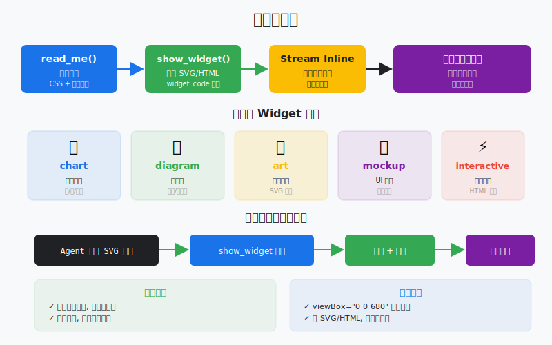
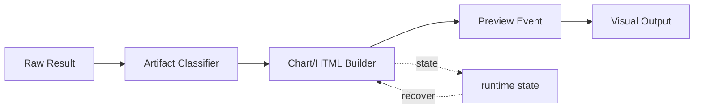

# s19: Visualizer — 不只是文字, 还能画图

> *"不只是文字, 还能画图"* — agent 的输出不是终端里的纯文本，而是流式注入的 SVG 图表和 HTML widget。
>
> **Harness 层**: 交互 — agent 的可视化引擎。

---



## 代码架构图



## 学习前置知识

- Agent 交付不一定是纯文本, 也可以是图、表、HTML、小组件。
- 可视化输出要有结构化数据支撑。
- 生成图形时要验证渲染结果, 不只检查字符串。

## 本章抓住的 WorkBuddy-style 机制

- 把 agent 输出转成 SVG/HTML artifact。
- 展示从文本计划到可视化组件的转换。
- 为结果呈现和最终 demo 增加交付形态。

## 常见误区

- 直接让模型吐复杂 SVG, 容易错位和不可维护。
- 没有预览验证, 图片坏了也不知道。
- 可视化没有数据来源, 会变成装饰。
## 问题

到 s18 为止，agent 的所有输出都是纯文本。这在 CLI 时代没问题——终端就是读文字的地方。但 WorkBuddy 是桌面应用，用户期望更丰富的交互。

你让 agent 设计一个系统架构，它给你输出 500 行文字描述。你让 agent 比较三个方案，它给你一个冗长的文字表格。你让 agent 解释一个数据流，它用纯文本画了一个歪歪扭扭的 ASCII 图。

这不是体验问题，是效率问题。一张架构图传递的信息量等于 1000 字描述，但人类看图只要 3 秒，看文字要 3 分钟。agent 能生成图，为什么只让它输出文字？

WorkBuddy 的 Visualizer 解决了这个问题。它不是"图片生成"——不调用 DALL-E 画一张 PNG。它是"代码可视化"——让 agent 直接生成 SVG 或 HTML 代码，流式注入到对话中，在用户界面里原地渲染。agent 既是思考者，也是设计师。

---

## 解决方案

```
         Visualizer: SVG/HTML Streaming Injection

  Agent Response
  ┌──────────────────────────────────────────┐
  │ Text: "Let me draw a diagram..."        │
  │                                          │
  │ Tool: show_widget                        │
  │ ┌────────────────────────────────────┐   │
  │ │ title: "System Architecture"       │   │
  │ │ widget_code: <svg viewBox="0 0 680 │   │
  │ │   400">...rect, path, text...</svg>│   │
  │ │ loading_messages: [                │   │
  │ │   "Preparing diagram",             │   │
  │ │   "Rendering SVG",                 │   │
  │ │   "Almost ready"                   │   │
  │ │ ]                                  │   │
  │ └────────────────────────────────────┘   │
  │                                          │
  │ Text: "As you can see, the cache..."    │
  └──────────────────────────────────────────┘
         │
         ▼
  ┌──────────────────────────────────────────┐
  │         WorkBuddy UI                     │
  │                                          │
  │  Let me draw a diagram...               │
  │                                          │
  │  ┌────────────────────────────────────┐ │
  │  │                                    │ │
  │  │     [Rendered SVG Diagram]         │ │
  │  │     ┌─────┐    ┌─────┐            │ │
  │  │     │ API │───►│ DB  │            │ │
  │  │     └─────┘    └─────┘            │ │
  │  │                                    │ │
  │  └────────────────────────────────────┘ │
  │                                          │
  │  As you can see, the cache...           │
  └──────────────────────────────────────────┘


         Two-Step Protocol
         
  Step 1: read_me(modules=["diagram"])
     │    → Returns CSS vars, colors, typography, layout rules
     │    → MUST be called before first show_widget
     ▼
  Step 2: show_widget(title, widget_code, loading_messages)
              → Renders SVG/HTML inline in conversation
```

| 组件 | 作用 |
|------|------|
| `read_me` | 加载设计指引（CSS 变量、颜色、排版规则），必须在首次 `show_widget` 前调用 |
| `show_widget` | 渲染 SVG 或 HTML widget，参数含标题、代码、加载消息 |
| 模块系统 | diagram, mockup, interactive, chart, art — 每个模块有不同的设计指引 |
| 主题感知 | 浅色主题用浅色背景，深色主题用深色背景 |
| 加载消息 | 渲染过程中显示的进度提示（1-4 条，每条约 5 个词） |

---

## 工作原理

### read_me: 设计指引加载

`read_me` 不是"读一个文件"——它是"加载一个设计模块的规范"。每个模块（diagram, mockup, interactive, chart, art）有自己的 CSS 变量、颜色系统、排版规则。

```python
DESIGN_GUIDES = {
    "diagram": {
        "css_vars": {
            "bg": "#ffffff", "fg": "#1a1a2e",
            "primary": "#3b82f6", "accent": "#f59e0b",
            "border": "#e2e8f0", "muted": "#64748b",
        },
        "rules": [
            "SVG viewBox must start with '0 0 680'",
            "Use rounded rectangles for nodes",
            "Arrows with markers for connections",
            "Maximum 7 nodes per diagram",
        ],
        "typography": {"title": "20px bold", "body": "14px", "label": "12px"},
    },
    "chart": {
        "css_vars": {
            "bg": "#ffffff", "fg": "#1a1a2e",
            "primary": "#3b82f6", "accent": "#ef4444",
            "grid": "#f1f5f9", "muted": "#94a3b8",
        },
        "rules": [
            "Use consistent color palette across series",
            "Always label axes",
            "Grid lines should be subtle",
        ],
    }
}
```

### show_widget: 渲染 widget

`show_widget` 接收三个核心参数：

```python
def show_widget(title: str, widget_code: str, loading_messages: list[str]):
    """
    title:          widget 标识符，用于引用和下载文件名
    widget_code:    原始 SVG 或 HTML 代码
    loading_messages: 渲染过程中显示的 1-4 条进度消息
    """
```

**SVG 规则**：
- 必须以 `<svg>` 标签开头
- viewBox 必须以 `0 0 680` 开头（如 `0 0 680 400`）
- 使用设计指引中的颜色变量

**HTML 规则**：
- 原始 HTML 片段
- 不包含 `<!DOCTYPE>`, `<html>`, `<head>`, `<body>` 标签
- 可以包含 `<style>` 和 `<script>`

### SVG 生成模式

```python
def generate_architecture_svg(nodes: list, edges: list) -> str:
    """Generate an SVG architecture diagram."""
    svg = ['<svg viewBox="0 0 680 400" xmlns="http://www.w3.org/2000/svg">']
    
    # Background
    svg.append(f'<rect width="680" height="400" fill="{design["bg"]}" rx="12"/>')
    
    # Nodes
    for i, node in enumerate(nodes):
        x, y = node["x"], node["y"]
        svg.append(f'<rect x="{x}" y="{y}" width="120" height="60" '
                   f'fill="{design["primary"]}" rx="8" opacity="0.15"/>')
        svg.append(f'<rect x="{x}" y="{y}" width="120" height="60" '
                   f'fill="none" stroke="{design["primary"]}" rx="8"/>')
        svg.append(f'<text x="{x+60}" y="{y+35}" text-anchor="middle" '
                   f'fill="{design["fg"]}" font-size="14">{node["label"]}</text>')
    
    # Edges
    svg.append(f'<defs><marker id="arrow" markerWidth="10" markerHeight="10" '
               f'refX="8" refY="3" orient="auto"><path d="M0,0 L8,3 L0,6 Z" '
               f'fill="{design["muted"]}"/></marker></defs>')
    for edge in edges:
        svg.append(f'<line x1="{edge["x1"]}" y1="{edge["y1"]}" '
                   f'x2="{edge["x2"]}" y2="{edge["y2"]}" '
                   f'stroke="{design["muted"]}" stroke-width="2" '
                   f'marker-end="url(#arrow)"/>')
    
    svg.append('</svg>')
    return '\n'.join(svg)
```

### 多 widget 叙事流

复杂主题不应该塞进一个巨大的图。WorkBuddy 的指引是：拆成多个小 widget，中间用文字串联：

```python
# Agent 生成多 widget 叙事:
# 
# Text: "Let me break this down into three parts..."
# 
# show_widget("Component Overview", svg_1, ["Loading overview..."])
# 
# Text: "Now let's look at the data flow..."
# 
# show_widget("Data Flow", svg_2, ["Preparing flow...", "Rendering..."])
# 
# Text: "Finally, here's the deployment topology..."
# 
# show_widget("Deployment Topology", svg_3, ["Drawing topology..."])
```

### 主题感知

```python
def get_theme_colors(theme: str = "light") -> dict:
    """Get colors for the current UI theme."""
    if theme == "dark":
        return {"bg": "#1a1a2e", "fg": "#e2e8f0", "primary": "#60a5fa",
                "border": "#334155", "muted": "#94a3b8"}
    return {"bg": "#ffffff", "fg": "#1a1a2e", "primary": "#3b82f6",
            "border": "#e2e8f0", "muted": "#64748b"}
```

---

## WorkBuddy 架构对照

### 两工具协议

生产级桌面 agent 的 Visualizer 通过两个工具实现：

**`read_me`**（工具描述节选）：
> Returns required context for show_widget (CSS variables, colors, typography, layout rules, examples). Call before your first show_widget call. Call again later if you need a different module. Do NOT mention or narrate this call to the user — it is an internal setup step.

**`show_widget`**（工具描述节选）：
> Show visual content — SVG graphics, diagrams, charts, or interactive HTML widgets — that renders inline alongside your text response. widget_code MUST be a raw SVG/HTML fragment (no `<html>`/`<head>`/`<body>`/`<!DOCTYPE>`); for SVG use a viewBox starting with `0 0 680`.

### 模块系统

五个设计模块，每个有独立的指引：

| 模块 | 用途 | 典型场景 |
|------|------|---------|
| `diagram` | 架构图、流程图 | 系统设计、数据流 |
| `mockup` | UI 原型 | 界面设计、布局预览 |
| `interactive` | 交互式 widget | 可操作的数据探索 |
| `chart` | 数据图表 | 趋势、对比、分布 |
| `art` | 装饰性图形 | 概念可视化、创意 |

### 渲染管线

1. Agent 调用 `read_me(modules=["diagram"])` → 获取设计指引
2. Agent 根据指引生成 SVG/HTML 代码
3. Agent 调用 `show_widget(title, widget_code, loading_messages)`
4. WorkBuddy 将 widget 代码注入对话流
5. 渲染器在对话中原地渲染 SVG/HTML
6. 用户看到内联的可视化内容

### 触发条件

Visualizer 在以下场景被触发：
- 用户明确要求："show me", "visualize", "diagram", "chart"
- 架构设计请求
- 教育性解释（需要图解辅助理解）
- 数据比较（表格不如图表直观）
- UI 设计讨论

### 不是图片生成

Visualizer 与 `ImageGen`（多模态内容生成技能）完全不同：

| 维度 | Visualizer | ImageGen |
|------|-----------|----------|
| 产出 | SVG/HTML 代码 | PNG/JPG 图片 |
| 渲染 | 浏览器原生渲染 | AI 模型生成 |
| 精度 | 矢量，无限缩放 | 位图，有分辨率限制 |
| 可编辑 | 代码可修改 | 图片不可编辑 |
| 速度 | 即时渲染 | 需要生成时间 |
| 用途 | 图表、架构图、UI | 插画、照片、艺术 |

---

## 代码 walkthrough

`code.py` 模拟了 Visualizer 的核心机制：

1. **设计指引系统** — 模拟 `read_me` 加载模块指引
2. **SVG 生成** — 提供 SVG 生成辅助函数（节点、箭头、图表）
3. **HTML widget 生成** — 模拟交互式 HTML 片段
4. **show_widget 渲染** — 将生成的代码写入文件并在终端预览
5. **多 widget 叙事** — 演示文字 + widget 交替的叙事流
6. **主题感知** — 浅色/深色主题切换

agent 可以：
- 用 `read_me` 加载设计指引
- 用 `show_widget` 渲染 SVG 图表和 HTML widget
- 在文字和可视化之间交替叙事

---

## 运行

```bash
python s19_visualizer/code.py
```

试试这些 prompt：

1. `Draw a system architecture diagram with API, Cache, and Database` — 生成架构图 SVG
2. `Create a bar chart comparing Python, Go, and Rust performance` — 生成数据图表
3. `Visualize the agent loop as a flowchart` — 生成流程图
4. `Show me a comparison table of REST vs GraphQL` — 生成 HTML widget

观察重点：agent 先调用 `read_me` 加载设计指引，再调用 `show_widget` 渲染可视化。生成的 SVG/HTML 被保存到文件并预览。

---

## 练习

1. 添加一个 `mockup` 模块的设计指引，包含 UI 原型的颜色和排版规则。让 agent 生成一个登录页面的 HTML mockup。
2. 实现多 widget 叙事：让 agent 在一次回答中生成 2-3 个 SVG，中间用文字串联。观察叙事流如何提升理解。
3. 实现深色主题：当用户输入 `/dark` 时切换到深色主题，重新生成上一个 widget。观察颜色变化。

---

## 下一课

s19 让 agent 能画图。但画完图之后呢？agent 做完一个任务——生成了一个报告、写了一个 PPT、产出了一个视频——怎么把这些成果"交付"给用户？

s20 Result Presentation → present_files, artifact cards。
