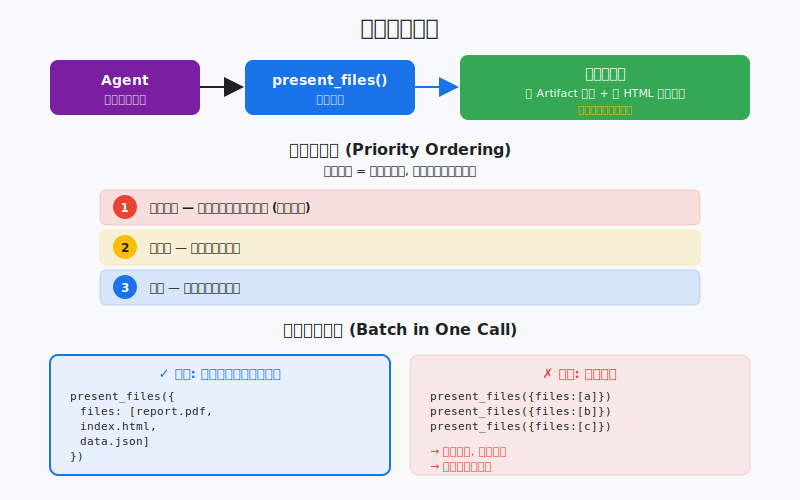

# s20: Result Presentation — 做完要交付, 不只是说

> *"做完要交付, 不只是说"* — 任务完成的标志不是 agent 说"我做完了"，而是用户看到了交付物。present_files 是唯一的交付入口。
>
> **Harness 层**: 交互 — agent 的成果交付系统。

---



## 代码架构图


## 学习前置知识

- 用户要的是交付物, 不只是过程说明。
- 结果呈现要按重要性排序: 文件、摘要、风险、下一步。
- 长任务需要批量呈现和可追溯 artifact。

## 本章抓住的 WorkBuddy-style 机制

- 把工具结果整理成文件卡、摘要和优先级列表。
- 展示 batch presentation 和 final response 的区别。
- 为最终 harness 的用户体验收口。

## 常见误区

- 把所有日志贴给用户, 会淹没结论。
- 只说“完成了”不列文件和验证, 用户无法信任。
- 没有错误和风险摘要, 失败会被包装成成功。
## 问题

到 s19 为止，agent 可以执行命令、读写文件、加载技能、接入外部工具、切换专家人格、生成可视化图表。但做完这一切之后，交付环节有一个隐藏的问题。

agent 生成了一个精美的 HTML 报告。然后呢？它在对话里说"我已经生成了 report.html，你可以在工作目录找到它。"用户得自己打开文件管理器，导航到工作目录，找到文件，双击打开。这在 CLI 时代理所当然——终端就是终端，文件系统就是文件系统。但在桌面应用中，这是糟糕的体验。

更糟糕的情况：agent 一次生成了 5 个文件——一个报告、一个图表、一个数据文件、一个配置文件、一个日志。它用 500 字描述每个文件在哪里。用户读完描述，还是得手动一个一个找。

WorkBuddy 的答案是 `present_files`——一个唯一的交付入口。agent 做完任务后，调用 `present_files` 把所有成果文件一次性展示给用户。第一个文件自动打开，用户立刻看到最重要的结果。不需要描述文件在哪——文件就在眼前。

这不是"锦上添花"，是"做完"的定义。WorkBuddy 的系统提示明确要求：每个产生可查看结果的任务，必须以 `present_files` 调用结束。

---

## 解决方案

```
         present_files: Single Entry Point for Delivery

  Task Complete
       │
       ▼
  ┌──────────────────────────────────────────────┐
  │            present_files(files)              │
  │                                              │
  │  files = [                                   │
  │    "/path/to/report.html",   ← 第一个自动打开 │
  │    "/path/to/chart.svg",     ← artifact card │
  │    "/path/to/data.json",     ← artifact card │
  │    "http://localhost:3000",  ← 浏览器预览    │
  │  ]                                           │
  └──────────────────────────────────────────────┘
       │
       ├──► 第一个文件: 自动打开/聚焦
       ├──► HTML 文件: 实时预览面板 + artifact card
       ├──► localhost URL: 内置浏览器预览面板
       ├──► 本地文件: artifact card (图片/报告/PPT/视频/代码)
       └──► http/https URL: 内置浏览器预览面板

  ┌──────────────────────────────────────────────┐
  │            WorkBuddy UI                       │
  │                                               │
  │  Agent: "I've generated the report..."       │
  │                                               │
  │  ┌─ Auto-opened Preview ──────────────────┐  │
  │  │                                        │  │
  │  │     [report.html rendered live]        │  │
  │  │                                        │  │
  │  └────────────────────────────────────────┘  │
  │                                               │
  │  ┌─ Artifact Cards ───────────────────────┐  │
  │  │                                        │  │
  │  │  ┌────────┐  ┌────────┐  ┌────────┐   │  │
  │  │  │📄 chart│  │📊 data │  │🌐 url  │   │  │
  │  │  │.svg    │  │.json   │  │:3000   │   │  │
  │  │  └────────┘  └────────┘  └────────┘   │  │
  │  │                                        │  │
  │  └────────────────────────────────────────┘  │
  └──────────────────────────────────────────────┘
```

| 文件类型 | 展示方式 | 行为 |
|---------|---------|------|
| HTML (.html/.htm) | 预览面板 + artifact card | 实时渲染，可交互 |
| localhost URL | 浏览器预览面板 | 打开本地开发服务器 |
| http/https URL | 浏览器预览面板 | 打开外部网页 |
| 图片 (png/jpg/svg) | artifact card | 缩略图预览 |
| 报告 (pdf/docx/pptx) | artifact card | 可下载/打开 |
| 视频 (mp4/mov) | artifact card | 可播放 |
| 代码 (.py/.js/.ts) | artifact card | 语法高亮预览 |
| 其他文件 | artifact card | 文件信息卡片 |

---

## 工作原理

### 文件队列与优先级

`present_files` 接收一个文件数组。数组的顺序就是优先级——第一个文件最重要，会被自动打开：

```python
def present_files(files: list[str], explanation: str = ""):
    """
    Present files to the user as the final delivery step.

    Args:
        files: Ordered list of file paths or URLs. 
               First item is auto-opened. Order = viewing priority.
        explanation: Brief description of what was produced.
    """
    if not files:
        return "Error: No files to present."

    # First file: auto-open
    primary = files[0]
    open_primary(primary)

    # Remaining files: artifact cards
    for f in files[1:]:
        create_artifact_card(f)
```

### HTML 预览面板

HTML 文件的特殊处理——它不只是 artifact card，还会在预览面板中实时渲染：

```python
def open_primary(file_path: str):
    """Open the primary file based on its type."""
    if file_path.startswith(("http://", "https://")):
        # URL: open in built-in browser preview
        open_browser_preview(file_path)
    elif file_path.startswith("http://localhost"):
        # localhost: open dev server preview
        open_browser_preview(file_path)
    elif file_path.endswith((".html", ".htm")):
        # HTML file: live preview panel + artifact card
        open_html_preview(file_path)
        create_artifact_card(file_path)
    else:
        # Other files: just artifact card
        create_artifact_card(file_path)
```

### Artifact Card 生成

每个文件都生成一个 artifact card，显示文件类型、名称、大小等信息：

```python
FILE_TYPE_ICONS = {
    ".html": "🌐", ".htm": "🌐",
    ".svg": "🖼️", ".png": "🖼️", ".jpg": "🖼️",
    ".pdf": "📄", ".docx": "📄", ".pptx": "📊",
    ".mp4": "🎬", ".mov": "🎬",
    ".py": "🐍", ".js": "📜", ".ts": "📜",
    ".json": "📋", ".csv": "📋",
    ".md": "📝",
}

def create_artifact_card(file_path: str):
    """Create an artifact card for a file."""
    path = Path(file_path)
    ext = path.suffix.lower()
    icon = FILE_TYPE_ICONS.get(ext, "📎")
    size = path.stat().st_size if path.exists() else 0

    return {
        "path": str(path),
        "name": path.name,
        "type": ext,
        "icon": icon,
        "size": format_size(size),
        "exists": path.exists(),
    }
```

### 什么文件该 present

关键原则：只 present 新生成的交付物，不 present 仅仅读取或修改的文件：

```python
# 正确: present 新生成的报告
present_files(["/workspace/report.html", "/workspace/chart.svg"])

# 错误: present 仅仅读取过的文件
present_files(["/workspace/existing_config.json"])  # 只是读过，不是产出

# 错误: present 修改过的源代码文件
present_files(["/workspace/src/main.py"])  # 只是改了几行，不是交付物
```

### 补充性原则

`present_files` 是补充性的——它不替代文字回复，而是在文字回复之上增加交付：

```python
# Agent 的正确行为:
# 1. 用文字简要说明做了什么
# 2. 调用 present_files 展示交付物
# 3. 文字 + 交付物一起呈现给用户

# 错误行为:
# 1. 只调用 present_files，不写任何文字说明
# 2. 写了 500 字描述文件内容，而不是让用户直接看文件
```

系统提示的指导原则："Give users direct access to their documents. Don't write extensive explanations of what's in the document."

---

## WorkBuddy 架构对照

### present_files 工具定义

生产级桌面 agent 的 `present_files` 工具描述（节选）：

> Present files and previews to the user as the final result of a task. This is the single entry point for showing results. Call this after producing files the user should view, inspect, or download. Pass all related items together; the order expresses viewing priority — put the item the user should see first at the beginning. The first item is automatically opened/focused for the user.

### 强制性要求

生产级桌面 agent 通常会在系统提示中要求：

> present_files is mandatory: "NEVER forget this step. Every completed task that produces a viewable result MUST end with a present_files call."

这意味着：
1. 如果任务产生了可查看的文件 → 必须调用 `present_files`
2. 调用必须是最后一个工具调用（在文字回复之前或之中）
3. 不能只说"文件在 xxx 路径"——必须 present

### 支持的文件类型

| 类型 | 扩展名/格式 | 展示方式 |
|------|-----------|---------|
| HTML | .html, .htm | 预览面板 + artifact card |
| 图片 | .png, .jpg, .jpeg, .svg, .gif, .webp | artifact card（缩略图） |
| 文档 | .pdf, .docx, .pptx, .xlsx | artifact card（可下载） |
| 视频 | .mp4, .mov, .avi, .webm | artifact card（可播放） |
| 代码 | .py, .js, .ts, .go, .rs, .java, .c, .cpp | artifact card（语法高亮） |
| 数据 | .json, .csv, .yaml, .xml | artifact card |
| URL | http://, https:// | 浏览器预览面板 |
| localhost | http://localhost:PORT | 浏览器预览面板（验证可达性） |

### localhost 特殊处理

当 present 的 URL 是 localhost 时，WorkBuddy 会：
1. 检查服务器是否在运行
2. 如果不可达，返回引导信息
3. 如果可达，在内置浏览器中打开预览

这要求 agent 在 present localhost URL 之前先启动服务器（使用 Bash 工具的 `run_in_background`）。

### cwd 参数

`present_files` 接受一个可选的 `cwd` 参数：

> The current working directory (absolute path). Recommended so the desktop app can route previews to the owning session, and required for localhost URLs so the tool can locate local files as fallback when the server is not reachable.

这让 WorkBuddy 能正确路由预览到对应的会话，并在服务器不可达时回退到本地文件。

### 与 Visualizer 的区别

| 维度 | Visualizer (s19) | present_files (s20) |
|------|-----------------|---------------------|
| 时机 | 过程中的可视化 | 任务完成的交付 |
| 产出 | SVG/HTML 内联渲染 | 文件/URL 展示 |
| 目的 | 辅助理解和解释 | 交付最终成果 |
| 持久性 | 在对话流中 | 独立的 artifact card |
| 调用次数 | 可多次 | 每个任务一次（最后） |

---

## 代码 walkthrough

`code.py` 模拟了 `present_files` 的核心机制：

1. **文件队列管理** — 有序文件列表，第一个自动"打开"
2. **文件类型识别** — 根据扩展名确定展示方式
3. **HTML 预览面板** — 模拟 HTML 文件的实时预览
4. **Artifact card 生成** — 为每个文件生成信息卡片
5. **优先级排序** — 文件顺序表达查看优先级
6. **交付流程** — 完整的任务 → 生成文件 → present_files 流程

agent 可以：
- 执行任务并生成文件
- 调用 `present_files` 交付成果
- 自动打开最重要的文件
- 为所有文件生成 artifact card

---

## 运行

```bash
python s20_result_presentation/code.py
```

试试这些 prompt：

1. `Generate a summary report about this project and save it as HTML` — 观察自动 present
2. `Create a simple web page with a counter and open it` — 观察 HTML 预览
3. `Write three Python utility scripts` — 观察多文件 artifact card
4. `Create a bar chart as SVG and a data file as JSON` — 观察混合类型交付

观察重点：任务完成后，agent 自动调用 `present_files`。第一个文件被"自动打开"，其余文件以 artifact card 形式展示。文件顺序表达了查看优先级。

---

## 练习

1. 实现 localhost URL 的 present：让 agent 启动一个简单的 HTTP 服务器（用 `python -m http.server`），然后 present `http://localhost:8000`。观察如何验证可达性。
2. 实现文件分组：修改 `present_files` 接受一个 `groups` 参数，将文件按类别分组展示（如"报告"组、"数据"组、"源码"组）。
3. 实现交付历史：记录每次 `present_files` 调用的文件列表，让用户可以回溯之前任务交付了哪些文件。

---

## 下一课

s20 让 agent 能交付成果。但交付之后呢？如果用户关闭了应用，下次打开时还能看到之前的对话吗？如果 agent 做了很多工作，用量怎么追踪？

s21 SQLite Database → 会话持久化, WAL, 7 张表。
