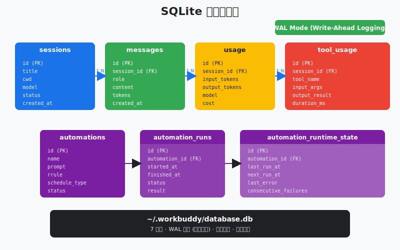
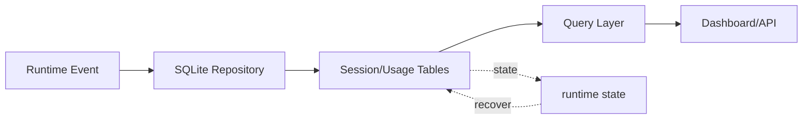

# s21: SQLite Database — 会话要持久, 用量要追踪

> *"会话要持久, 用量要追踪"* — SQLite WAL 模式, 7 张表, 一切状态皆可恢复。
>
> **Harness 层**: 持久化 — agent 的记忆不只在上下文窗口里, 还在磁盘上。

---



## 代码架构图



## 学习前置知识

- SQLite 适合本地桌面应用的结构化状态。
- JSONL 保存事件流, SQLite 保存索引、状态和统计。
- WAL 模式能改善并发读写体验。

## 本章抓住的 WorkBuddy-style 机制

- 保存 sessions、messages、usage、automation 等元数据。
- 展示本地数据库和 JSONL transcript 的分工。
- 为自动化和审计提供可查询状态。

## 常见误区

- 把所有大文本塞 SQLite, 会让数据库膨胀且难迁移。
- 没有 migration_meta, schema 演进会痛苦。
- 只靠文件夹状态, 很难做列表、搜索和统计。
## 问题

Agent loop 跑完一轮, 上下文窗口里的消息就是全部状态。关掉终端, 一切消失。

这对 CLI 工具可以接受——用完即走, 下次重来。但桌面 AI 助手是常驻的。用户期望：

- 昨天的会话能继续聊
- 上周创建的定时任务还在跑
- 这个月花了多少 token、多少钱, 一目了然
- 自动化的运行历史可查

这些需求指向同一个答案：你需要一个数据库。

WorkBuddy 选择 SQLite。不是 PostgreSQL, 不是 MongoDB, 而是 SQLite。原因很简单：桌面应用不该依赖外部数据库服务。一个 `.db` 文件, 零配置, 随应用启动而可用, 随应用关闭而持久化。但默认的 SQLite 有个问题：写入时会锁住整个数据库, 读取也被阻塞。WorkBuddy 的 agent loop 在写入会话消息的同时, UI 还要读取会话列表。这种并发需求需要 WAL 模式。

---

## 解决方案

```
~/.workbuddy/
  workbuddy.db          ← 主数据库文件
  workbuddy.db-wal      ← Write-Ahead Log (WAL)
  workbuddy.db-shm      ← 共享内存索引
```

WAL 模式下, 写入先追加到 `-wal` 文件, 不干扰主数据库的读取。读取操作看到的是 WAL 之前的主库快照。多个读和一个写可以同时进行, 不互相阻塞。

| 设计决策 | 选择 | 原因 |
|---------|------|------|
| 数据库引擎 | SQLite | 嵌入式, 零配置, 单文件 |
| 并发模式 | WAL | 读写不互斥 |
| 表数量 | 7 张 | 各司其职, 不冗余 |
| 删除策略 | 软删除 | 数据不可丢失, 可恢复 |
| 文件位置 | `~/.workbuddy/` | 用户级目录, 跨应用版本持久 |

### 7 张表概览

```
┌─────────────────────────────────────────────────────┐
│                  workbuddy.db                        │
├──────────────┬──────────────────────────────────────┤
│ sessions     │ 会话元数据: cwd, title, model, mode   │
├──────────────┼──────────────────────────────────────┤
│ messages     │ 会话消息: role, content, tool_calls   │
├──────────────┼──────────────────────────────────────┤
│ automations  │ 自动化定义: prompt, rrule, status     │
├──────────────┼──────────────────────────────────────┤
│ auto_runtime │ 运行时状态: last_run, next_run        │
├──────────────┼──────────────────────────────────────┤
│ auto_runs    │ 执行历史: started, completed, output  │
├──────────────┼──────────────────────────────────────┤
│ tool_usage   │ 工具用量: tool_name, call_count       │
├──────────────┼──────────────────────────────────────┤
│ usage_track  │ Token 追踪: input, output, cost       │
└──────────────┴──────────────────────────────────────┘
```

---

## 工作原理

### 1. WAL 模式初始化

```python
import sqlite3

db = sqlite3.connect("~/.workbuddy/workbuddy.db")
db.execute("PRAGMA journal_mode=WAL")    # 启用 WAL
db.execute("PRAGMA synchronous=NORMAL")  # 平衡安全与性能
db.execute("PRAGMA foreign_keys=ON")     # 外键约束
```

三条 PRAGMA 决定了数据库的行为。WAL 模式让读写不再互斥；`synchronous=NORMAL` 在 WAL 下足够安全且更快；外键约束保证表间一致性。

### 2. 表结构定义

**sessions** — 每个会话一行：

```sql
CREATE TABLE IF NOT EXISTS sessions (
    id          TEXT PRIMARY KEY,
    cwd         TEXT NOT NULL,
    title       TEXT,
    status      TEXT DEFAULT 'active',   -- active / archived / deleted
    mode        TEXT DEFAULT 'code',     -- code / ask / plan
    model       TEXT,
    expert_id   TEXT,
    created_at  TEXT NOT NULL,
    updated_at  TEXT NOT NULL
);
```

**automations** — 自动化定义（s22 详述）：

```sql
CREATE TABLE IF NOT EXISTS automations (
    id              TEXT PRIMARY KEY,
    name            TEXT NOT NULL,
    prompt          TEXT NOT NULL,
    schedule_type   TEXT NOT NULL,    -- recurring / once
    rrule           TEXT,
    scheduled_at    TEXT,
    status          TEXT DEFAULT 'ACTIVE',  -- ACTIVE / PAUSED / deleted
    valid_from      TEXT,
    valid_until     TEXT,
    cwds            TEXT,             -- JSON array
    expert_id       TEXT,
    model_id        TEXT,
    connector_ids   TEXT,             -- JSON array
    created_at      TEXT NOT NULL,
    updated_at      TEXT NOT NULL
);
```

**usage_tracking** — Token 和成本追踪：

```sql
CREATE TABLE IF NOT EXISTS usage_tracking (
    id                      INTEGER PRIMARY KEY AUTOINCREMENT,
    session_id              TEXT NOT NULL,
    model                   TEXT NOT NULL,
    input_tokens            INTEGER DEFAULT 0,
    output_tokens           INTEGER DEFAULT 0,
    cache_creation_tokens   INTEGER DEFAULT 0,
    cache_read_tokens       INTEGER DEFAULT 0,
    cost                    REAL DEFAULT 0.0,
    created_at              TEXT NOT NULL,
    FOREIGN KEY (session_id) REFERENCES sessions(id)
);
```

### 3. 会话 CRUD

```python
def create_session(cwd, model="claude-sonnet-4-20250514"):
    sid = f"sess_{int(time.time()*1000)}"
    now = datetime.now().isoformat()
    db.execute(
        "INSERT INTO sessions (id, cwd, title, status, mode, model, created_at, updated_at) "
        "VALUES (?, ?, ?, 'active', 'code', ?, ?, ?)",
        (sid, cwd, "New Session", model, now, now)
    )
    db.commit()
    return sid

def list_sessions(status="active"):
    rows = db.execute(
        "SELECT id, title, cwd, updated_at FROM sessions "
        "WHERE status = ? ORDER BY updated_at DESC", (status,)
    ).fetchall()
    return rows
```

### 4. 用量追踪

每次 API 调用后, 把 token 用量写入数据库：

```python
def track_usage(session_id, model, response):
    usage = response.usage
    cost = calc_cost(model, usage)
    db.execute(
        "INSERT INTO usage_tracking "
        "(session_id, model, input_tokens, output_tokens, "
        " cache_creation_tokens, cache_read_tokens, cost, created_at) "
        "VALUES (?,?,?,?,?,?,?,?)",
        (session_id, model, usage.input_tokens, usage.output_tokens,
         usage.cache_creation_input_tokens, usage.cache_read_input_tokens,
         cost, datetime.now().isoformat())
    )
    db.commit()
```

查询某月的总开销：

```python
def monthly_cost(year_month="2026-07"):
    row = db.execute(
        "SELECT SUM(cost), SUM(input_tokens), SUM(output_tokens) "
        "FROM usage_tracking WHERE created_at LIKE ?",
        (f"{year_month}%",)
    ).fetchone()
    return {"cost": row[0] or 0, "input": row[1] or 0, "output": row[2] or 0}
```

### 5. 软删除 — 永不丢失数据

```python
def soft_delete(table, item_id):
    """软删除: 标记为 deleted, 不从表中移除"""
    db.execute(
        f"UPDATE {table} SET status='deleted', updated_at=? WHERE id=?",
        (datetime.now().isoformat(), item_id)
    )
    db.commit()
```

`SELECT` 查询过滤掉 `status='deleted'` 的行, 但数据仍在磁盘上。这是 WorkBuddy 的核心安全原则——**永远不用 `DELETE FROM` 或 `rm` 删除自动化**, 只标记为已删除。

---

## WorkBuddy 架构对照

> 基于桌面 agent harness 可观察行为抽象出的 clean-room 对照。

### 数据库初始化

生产级 Sidecar 通常在启动时初始化数据库连接。教学版可抽象为：

```javascript
// 简化的初始化模式
const db = new Database(path.join(homeDir, '.workbuddy', 'workbuddy.db'));
db.pragma('journal_mode = WAL');
db.pragma('synchronous = NORMAL');
```

WorkBuddy 使用 `better-sqlite3`（同步接口, 比 `node-sqlite3` 快 4-5 倍）, 在主线程同步操作, 但因为 WAL 模式下操作极快, 不阻塞 UI。

### 自动化的软删除

WorkBuddy 的 `automation_update` 工具（mode="delete"）执行软删除：

```javascript
// 实际模式：标记 status 而非 DELETE
db.prepare(
  "UPDATE automations SET status = 'deleted', updated_at = ? WHERE id = ?"
).run(new Date().toISOString(), automationId);
```

删除后, `list` 和 `view` 模式查询会过滤 `status != 'deleted'`：

```javascript
const automations = db.prepare(
  "SELECT * FROM automations WHERE status != 'deleted' ORDER BY updated_at DESC"
).all();
```

### 用量追踪与 UI 展示

WorkBuddy 的设置页面读取 `usage_tracking` 表, 展示按月/按会话的 token 消耗和成本。每条 API 响应的 `usage` 对象被实时写入数据库。

---

## 代码 walkthrough

`code.py` 模拟了 WorkBuddy 的 SQLite 数据库层：

1. **初始化 WAL 模式** — 创建 `~/.workbuddy/workbuddy.db`, 设置 PRAGMA
2. **创建 7 张表** — 完整的 schema 定义
3. **会话 CRUD** — 创建、列表、归档、软删除
4. **用量追踪** — 每次 API 调用后记录 token 用量
5. **工具用量统计** — 记录每个工具的调用次数
6. **Agent loop 集成** — 真实的 agent 循环, 每轮都写入数据库

运行后, 你可以在 `~/.workbuddy/workbuddy.db` 中用 `sqlite3` 查看数据。

---

## 运行

```bash
python s21_sqlite_database/code.py
```

运行后试试这些操作：

1. 和 agent 聊几轮, 观察 sessions 和 messages 表的变化
2. 输入 `stats` 查看用量统计
3. 输入 `sessions` 列出所有会话
4. 用 `sqlite3 ~/.workbuddy/workbuddy.db "SELECT * FROM usage_tracking"` 查看原始数据

---

## 练习

1. 给 `sessions` 表添加一个 `tags` 列（JSON 数组）, 并实现按 tag 过滤会话列表
2. 实现一个 `export_session(sid)` 函数, 把某个会话的所有消息导出为 JSON 文件
3. 添加一个 `daily_usage_report()` 函数, 按天聚合 token 用量和成本, 输出最近 7 天的报表

---

## 下一课

数据库有了, 自动化定义存在 `automations` 表里。但谁来检查"到时间了没有"？谁来执行到期的任务？

s22 Automation Scheduler → 解析 RRULE, 计算下次运行时间, 到点自动触发。
