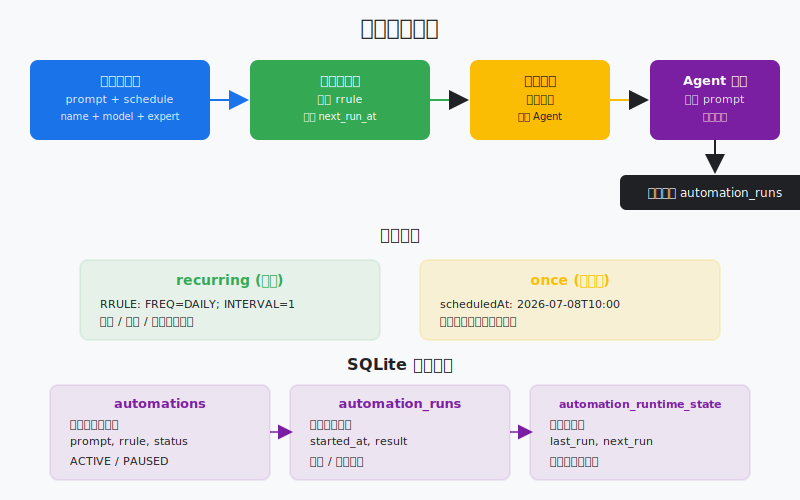
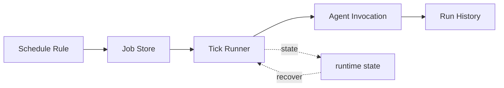

# s22: Automation Scheduler — 到点自动跑, 不需要人推

> *"到点自动跑, 不需要人推"* — recurring/once, RFC 5545 RRULE, 软删除可恢复。
>
> **Harness 层**: 调度 — agent 不只在用户提问时才工作, 它可以自己到点醒来。

---



## 代码架构图



## 学习前置知识

- 自动化是“未来某个时间创建一次 agent run”。
- 调度器需要持久化, 不能只存在内存。
- 重复任务要处理错过执行、并发和失败重试。

## 本章抓住的 WorkBuddy-style 机制

- 用 once/recurring 任务和 SQLite 状态模拟调度器。
- 把 Sidecar 常驻能力扩展为定时唤醒。
- 记录 run history 方便审计和排错。

## 常见误区

- 定时任务直接调用模型但不记录输入输出, 后续无法解释。
- 不处理重入, 同一任务可能并发跑多次。
- 自动化绕过权限系统, 风险比手动更高。
## 问题

你每天早上都要让 agent 做同一件事：检查项目状态、总结昨日进展、生成日报。没有自动化之前, 你得每天手动打开 WorkBuddy, 输入同样的 prompt, 等它跑完。周末忘了跑, 日报就断了。

另一种场景：你希望 agent 在三天后的部署窗口执行一次回滚脚本。这不是定时任务——它只跑一次, 跑完就结束。

这两个场景指向同一种机制：**调度器**。用户定义"做什么"和"什么时候做", 调度器负责在正确的时间触发 agent, 无需人工介入。

CLI agent 做不到这件事——它用完即走, 没有常驻进程来检查时间。桌面 AI 助手天然常驻, 它的 Sidecar 进程一直在跑, 随时可以检查"有没有任务到期了"。

---

## 解决方案

```
┌──────────────────────────────────────────────────┐
│              Automation Scheduler                 │
│                                                  │
│  ┌─────────┐   ┌─────────┐   ┌───────────────┐  │
│  │ Once    │   │ Daily   │   │ Weekly        │  │
│  │ (ISO    │   │ (RRULE  │   │ (RRULE        │  │
│  │  datetime)│   │  FREQ=  │   │  FREQ=WEEKLY) │  │
│  │         │   │  DAILY) │   │               │  │
│  └────┬────┘   └────┬────┘   └──────┬────────┘  │
│       │              │               │            │
│       ▼              ▼               ▼            │
│  ┌────────────────────────────────────────────┐  │
│  │          next_run calculator               │  │
│  │   (RRULE parse → next datetime)            │  │
│  └──────────────────┬─────────────────────────┘  │
│                     │                             │
│  ┌──────────────────▼─────────────────────────┐  │
│  │     Scheduler Loop (every 60s)             │  │
│  │   if now >= next_run:                      │  │
│  │     1. Execute prompt in isolated session  │  │
│  │     2. Record run history                  │  │
│  │     3. Update runtime state                │  │
│  │     4. Calculate next next_run             │  │
│  └────────────────────────────────────────────┘  │
└──────────────────────────────────────────────────┘
```

| 概念 | 说明 |
|------|------|
| `schedule_type` | `"recurring"` (重复) 或 `"once"` (单次) |
| `rrule` | RFC 5545 规则字符串, 如 `FREQ=DAILY;INTERVAL=1` |
| `scheduled_at` | ISO 8601 时间, 仅 `once` 类型使用 |
| `status` | `ACTIVE` / `PAUSED` / `deleted` (软删除) |
| `runtime_state` | 记录 `last_run`, `next_run`, `last_status` |
| `automation_runs` | 每次执行的历史记录 |

---

## 工作原理

### 1. RRULE — RFC 5545 重复规则

RRULE 是 iCalendar 标准的重复规则格式。WorkBuddy 支持五种频率：

```
FREQ=DAILY;INTERVAL=1       → 每天一次
FREQ=DAILY;INTERVAL=2       → 每两天一次
FREQ=HOURLY;INTERVAL=6      → 每 6 小时一次
FREQ=WEEKLY;BYDAY=MO,WE,FR  → 每周一三五
FREQ=MONTHLY;BYDAY=1MO      → 每月第一个周一
FREQ=YEARLY                 → 每年一次
```

解析 RRULE 并计算下次运行时间：

```python
from datetime import datetime, timedelta

def next_run_from_rrule(rrule: str, after: datetime) -> datetime:
    """简化版 RRULE 解析器。"""
    parts = dict(p.split("=") for p in rrule.upper().split(";"))
    freq = parts.get("FREQ", "DAILY")
    interval = int(parts.get("INTERVAL", "1"))

    if freq == "HOURLY":
        return after + timedelta(hours=interval)
    elif freq == "DAILY":
        return after + timedelta(days=interval)
    elif freq == "WEEKLY":
        return after + timedelta(weeks=interval)
    elif freq == "MONTHLY":
        return after + timedelta(days=30 * interval)
    elif freq == "YEARLY":
        return after + timedelta(days=365 * interval)
    return after + timedelta(days=1)
```

### 2. 调度器循环

```python
def scheduler_tick():
    """每 60 秒调用一次, 检查到期任务。"""
    now = datetime.now()

    # 查找所有 ACTIVE 且到期的自动化
    due = db.execute("""
        SELECT a.id, a.name, a.prompt, a.schedule_type, a.rrule, a.scheduled_at
        FROM automations a
        LEFT JOIN automation_runtime_state r ON a.id = r.automation_id
        WHERE a.status = 'ACTIVE'
          AND (r.next_run IS NULL OR r.next_run <= ?)
    """, (now.isoformat(),)).fetchall()

    for auto in due:
        execute_automation(auto)
        update_runtime_state(auto)
```

### 3. 自动化执行 — Prompt 隔离

自动化的 prompt 是自包含的——用户可能不在场回答问题, 所以 prompt 必须包含全部上下文：

```python
def execute_automation(auto):
    """在隔离会话中执行自动化。"""
    # 创建新会话, 不复用用户的会话
    session_id = create_session(cwd=auto["cwds"], model=auto["model_id"])

    # 记录执行开始
    run_id = db.execute(
        "INSERT INTO automation_runs (automation_id, started_at, status) "
        "VALUES (?, ?, 'running')",
        (auto["id"], datetime.now().isoformat())
    ).lastrowid

    try:
        # 执行 prompt (agent loop)
        messages = [{"role": "user", "content": auto["prompt"]}]
        agent_loop(messages, session_id)

        # 记录成功
        db.execute(
            "UPDATE automation_runs SET completed_at=?, status='success' WHERE id=?",
            (datetime.now().isoformat(), run_id)
        )
    except Exception as e:
        db.execute(
            "UPDATE automation_runs SET completed_at=?, status='failed', output=? WHERE id=?",
            (datetime.now().isoformat(), str(e), run_id)
        )
```

### 4. 软删除 — 永不真正删除

```python
def delete_automation(auto_id):
    """
    软删除: 标记 status='deleted'。
    NEVER use: DELETE FROM automations
    NEVER use: rm, sqlite3 CLI, or file operations
    """
    db.execute(
        "UPDATE automations SET status='deleted', updated_at=? WHERE id=?",
        (datetime.now().isoformat(), auto_id)
    )
    db.commit()
    # 行从 list/view 中消失, 但数据仍在数据库中, 可恢复
```

这是 WorkBuddy 的硬性规则。`automation_update` 工具的 `delete` 模式执行的就是这个操作。即使用户说"删掉这个自动化", 系统也不会执行 `DELETE FROM`, 而是标记为 `deleted`。

### 5. 两种调度类型

```python
def calculate_next_run(auto) -> str | None:
    """根据调度类型计算下次运行时间。"""
    now = datetime.now()

    if auto["schedule_type"] == "once":
        # 单次: 跑完就没了, next_run = None
        return None

    elif auto["schedule_type"] == "recurring":
        # 重复: 根据 RRULE 计算下次
        last = get_last_run(auto["id"]) or now
        return next_run_from_rrule(auto["rrule"], last)

    return None
```

---

## WorkBuddy 架构对照

> 基于桌面 agent harness 可观察行为抽象出的 clean-room 对照。

### automation_update 工具

WorkBuddy 的 `automation_update` 工具支持 5 种模式：`list`、`view`、`create`、`update`、`delete`。每种模式的参数定义在工具 schema 中：

```javascript
// create 模式的核心字段
{
  mode: "create",
  name: "每日项目检查",
  prompt: "检查项目状态, 生成日报",
  scheduleType: "recurring",
  rrule: "FREQ=DAILY;INTERVAL=1",
  status: "ACTIVE",
  cwds: "/Users/me/project",
  expertId: "SoftwareCompany",
  modelId: "claude-sonnet-4-20250514"
}
```

### 调度器在 Sidecar 中运行

WorkBuddy-style 桌面 agent 的 Sidecar 进程是常驻的, 它内部运行调度器循环：

```javascript
// 简化的调度器循环
setInterval(async () => {
    const dueAutomations = db.prepare(`
        SELECT a.*, r.next_run
        FROM automations a
        LEFT JOIN automation_runtime_state r ON a.id = r.automation_id
        WHERE a.status = 'ACTIVE'
          AND (r.next_run IS NULL OR r.next_run <= ?)
    `).all(new Date().toISOString());

    for (const auto of dueAutomations) {
        await executeAutomation(auto);
        updateRuntimeState(auto);
    }
}, 60_000);  // 每分钟检查一次
```

### 软删除的实现

```javascript
// automation_update mode="delete"
// NEVER: db.prepare("DELETE FROM automations WHERE id=?").run(id)
// NEVER: fs.unlinkSync(automationFile)
// ALWAYS: soft delete
db.prepare(
    "UPDATE automations SET status='deleted', updated_at=? WHERE id=?"
).run(new Date().toISOString(), id);
```

删除后, `list` 和 `view` 模式自动过滤：

```javascript
// list 模式
db.prepare("SELECT * FROM automations WHERE status != 'deleted'").all();
// view 模式
db.prepare("SELECT * FROM automations WHERE id=? AND status != 'deleted'").get(id);
```

### Prompt 自足性

WorkBuddy 的自动化 prompt 不能依赖用户实时交互。如果 prompt 中有"你觉得呢？"之类的问题, agent 会在自动化会话中卡住。因此系统提示词中会注入："你正在执行一个自动化任务, 用户可能不在场, 请自主完成, 不要提问。"

---

## 代码 walkthrough

`code.py` 模拟了 WorkBuddy 的自动化调度器：

1. **RRULE 解析** — 简化版 RFC 5545 解析器, 支持 5 种频率
2. **自动化 CRUD** — 创建、列表、暂停/恢复、软删除
3. **调度器循环** — 检查到期任务, 执行, 更新状态
4. **运行历史** — 记录每次执行的结果
5. **交互式 REPL** — 用 `/create`、`/list`、`/run`、`/delete` 管理自动化

运行后, 你可以创建自动化任务, 手动触发调度器检查, 查看运行历史。

---

## 运行

```bash
python s22_automation_scheduler/code.py
```

试试这些操作：

1. `/create` — 创建一个新的自动化任务
2. `/list` — 列出所有自动化
3. `/run` — 手动触发调度器检查（模拟定时触发）
4. `/delete <id>` — 软删除一个自动化
5. `/history <id>` — 查看某个自动化的运行历史

---

## 练习

1. 添加 `BYDAY` 支持, 让 `FREQ=WEEKLY;BYDAY=MO,WE,FR` 能正确计算下一个工作日
2. 实现 `PAUSE`/`RESUME` 命令, 暂停时 `next_run` 设为 `NULL`, 恢复时重新计算
3. 添加 `valid_from` 和 `valid_until` 检查, 让自动化只在有效期内运行

---

## 下一课

会话持久化了, 自动化能定时跑了。但 agent 的每一步操作——执行了什么命令、修改了什么文件——谁来记录？如果出了问题, 怎么追溯？

s23 Audit & Sandbox → SHA256 哈希链审计日志 + 命令沙盒, 每步留痕, 不可篡改。
